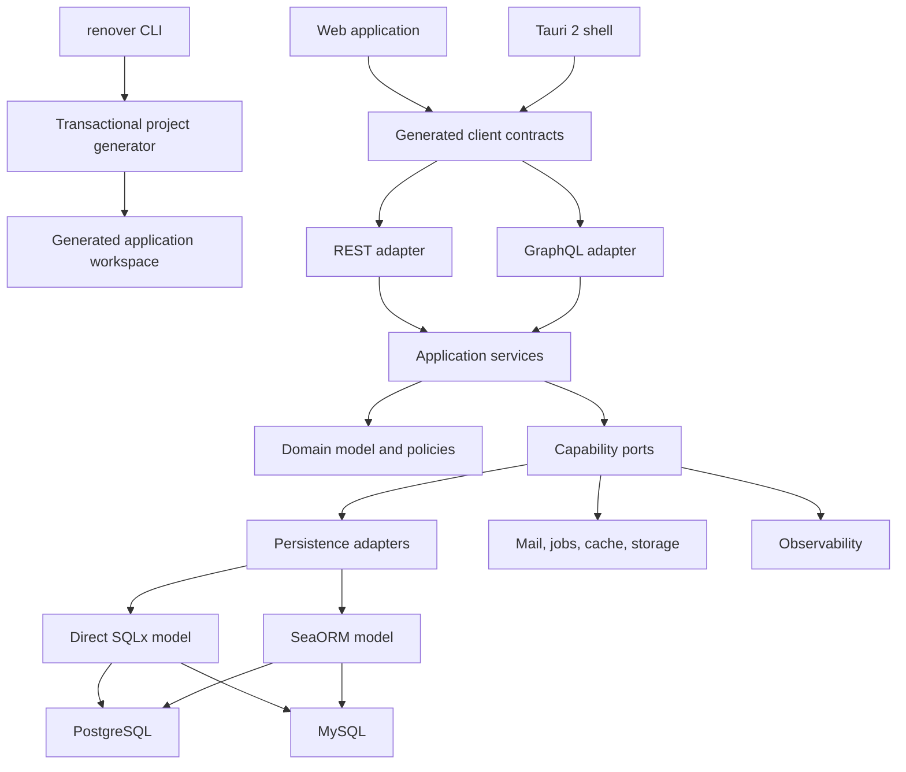

# Renvor Framework Development Plan

**Status:** Program execution authority<br>
**Plan version:** 1.1.0<br>
**Date:** 2026-08-11<br>
**Owner:** Ahmed Anbar<br>
**Planning system:** GitHub Spec Kit

## 1. Authority and purpose

This document is the single execution authority for developing Renvor. It defines the product promises, architecture boundaries, release train, phase order, compatibility matrix, quality gates, security baseline, publishing process, and completion criteria.

The older root planning documents remain research references only. If they conflict with this document or the constitution, this document wins. They may be archived after Phase 001 once their still-useful evidence has been linked from the relevant specifications.

Renvor will be a cohesive, package-first Rust application framework with explicit runtime behavior and normal, inspectable Rust underneath. The framework will make common backend work consistent without hiding I/O, transactions, authorization, configuration, failures, or lifecycle boundaries.

## 2. Product outcome

Renvor must let a team move from a blank directory to a production-shaped application while retaining control of every important boundary.

```text
renover new
    |
    +-- API only ---------------- REST and later GraphQL
    |
    +-- Full stack -------------- backend + selected web frontend
    |      +-- Next.js
    |      +-- Yew
    |      +-- Dioxus
    |      +-- Leptos
    |      +-- Styling ---------- CSS, SCSS, or Tailwind CSS
    |
    +-- Desktop ----------------- backend + web frontend + Tauri 2 shell
    |
    +-- Data -------------------- SQLx or SeaORM
    |      +-- PostgreSQL
    |      +-- MySQL
    |
    +-- Extensions ------------- installable Renvor packages
           +-- RBAC reference package
           +-- future community packages
```

The same domain and application services must serve every selected transport and client. REST, GraphQL, web, desktop, and command-line entry points are adapters around one application core, not parallel implementations of business rules.

## 3. Product principles

1. **Cohesion over hidden convenience.** Defaults are productive, but state, I/O, async work, transactions, authorization, configuration, errors, and shutdown remain visible.
2. **Package first.** Mature Rust and web packages sit behind narrow Renvor boundaries. Custom infrastructure requires an architecture decision record and evidence that maintained packages do not meet the requirement.
3. **Transport-independent services.** Application services cannot depend on Axum, GraphQL request types, frontend frameworks, or Tauri commands.
4. **Reliability before breadth.** REST 1.0 stabilizes before GraphQL 2.0; full-stack and desktop 3.0 follow only after both backend contracts are stable.
5. **Explicit support.** The compatibility matrix is a release contract. Unsupported combinations fail before generation; there are no silent substitutions or hidden secondary databases.
6. **Secure defaults.** Generated applications are deny-by-default, redact secrets, bound work, validate input, fail closed, and produce actionable startup failures.
7. **Generated code is owned code.** Scaffolds are readable, formatted, testable, documented, and editable without proprietary runtime machinery.
8. **Documentation is part of the product.** Every public feature ships with reference documentation, a tested example, migration notes, and searchable versioned pages.
9. **Claims require measurements.** Performance and reliability claims must point to reproducible benchmarks or test evidence.
10. **Applications remain extensible.** Existing Renvor applications can add, update, inspect, and remove compatible packages through a deterministic, reviewable project change.

## 4. Naming and public identity

| Item | Contract |
|---|---|
| Product and framework | `Renvor` |
| Crate prefix | `renvor-` |
| Main facade crate | `renvor` |
| CLI package | `renvor-cli` |
| Installed executable | `renover` |
| Primary project command | `renover new` |
| Project state directory | `.renvor/` |
| Environment prefix | `RENVOR_` |

Phase 001 must verify the GitHub organization/repository names, crates.io crate names, documentation domain, and executable name before public references are frozen. If a name is unavailable, work stops for an explicit naming decision. No alternative name is selected automatically.

An ADR must explain the intentional distinction between the Renvor product name and the `renover` executable. Tests and documentation must use the executable name consistently.

## 5. Release train

| Product line | Outcome | Earliest release gate |
|---|---|---|
| `0.x` | Preview kernel, CLI, REST, persistence, auth, capabilities, and documentation | Phase-specific preview tags |
| `1.0` | Stable REST framework and backend auth starter | Phase 013 |
| `2.0` | Optional GraphQL using the same application core | Phase 018 |
| `3.0` | Full-stack web, generated auth UI, and Tauri desktop | Phase 026 |
| `4.0` | Installable package SDK, package lifecycle, catalog contract, and official RBAC package | Phase 030 |
| Post-`4.0` | Candidate Vue and Angular presets plus additional official/community packages | Not committed to a release |

GraphQL must impose zero direct dependency or compile-time cost on REST-only applications. Full-stack templates and Tauri must impose zero dependency or build-tool cost on API-only applications.

## 6. Spec Kit execution model

Each numbered phase maps to exactly one feature directory:

```text
specs/NNN-short-name/
├── spec.md
├── plan.md
├── research.md
├── data-model.md          # when the phase changes persisted data
├── contracts/             # public schemas, examples, or protocols
├── quickstart.md
├── tasks.md
└── checklists/
```

Only the active phase is expanded. Later phases remain roadmap contracts in this file until their dependencies are complete.

### 6.1 Required workflow for every phase

1. Run `/speckit-specify` from the phase goal, user stories, exclusions, and acceptance criteria in this document.
2. Run `/speckit-clarify` until no material product or architecture ambiguity remains.
3. Run `/speckit-plan`; research every external package and standard before selecting it.
4. Record consequential choices as ADRs. A proposed ADR is not accepted until reviewed.
5. Run `/speckit-checklist` for requirements quality, security, compatibility, documentation, and release concerns.
6. Run `/speckit-tasks` with small, dependency-ordered tasks and explicit test work.
7. Run `/speckit-analyze` and resolve inconsistencies among the constitution, specification, plan, and tasks. Review generated contracts separately against the specification and plan.
8. Run `/speckit-implement` in testable slices. Keep the workspace buildable after every slice.
9. Run `/speckit-converge` before phase approval to reconcile implementation, documentation, examples, and acceptance evidence.
10. Obtain an independent requirements and security review. A phase with unresolved release blockers remains open.

### 6.2 Phase completion record

Every completed phase must link:

- accepted ADRs;
- selected package versions and license review;
- commands and platforms used for verification;
- compatibility rows exercised;
- security checklist evidence;
- generated-project smoke tests;
- documentation and migration notes;
- known limitations with an owner and target phase.

## 7. Architecture



### 7.1 Dependency rule

Dependencies point inward:

```text
delivery adapters -> application -> domain
infrastructure adapters -> application ports -> domain
```

The domain has no dependency on Tokio, Axum, SQLx, SeaORM, GraphQL, Tauri, Next.js, or a frontend framework. Application services may define async ports but cannot import delivery-specific request, response, context, or UI types.

### 7.2 Framework lifecycle

The framework lifecycle is deterministic and observable:

```text
Load -> Validate -> Register -> Boot -> Ready -> Drain -> Stop
```

- Configuration is loaded and validated before network listeners start.
- Providers register dependencies before booting external resources.
- A partially booted application rolls back already-started providers in reverse order.
- Readiness is not reported before required dependencies pass their declared checks.
- Drain stops new work, waits within configured bounds, then shuts down in reverse order.
- Timeouts and forced termination are visible errors, never successful shutdowns.

### 7.3 Planned workspace

```text
crates/
├── renvor/                    # facade and prelude
├── renvor-core/               # application, provider, lifecycle contracts
├── renvor-config/             # typed layered configuration
├── renvor-error/              # stable errors and redaction
├── renvor-http/               # Axum/Tower REST adapter
├── renvor-validation/         # validation boundary
├── renvor-openapi/            # OpenAPI 3.2 generation
├── renvor-database/           # transactions, migrations, persistence ports
├── renvor-sqlx/               # direct SQLx adapter
├── renvor-seaorm/             # SeaORM adapter
├── renvor-auth/               # authentication primitives and flows
├── renvor-policy/             # authorization policies
├── renvor-cache/              # cache port and adapters
├── renvor-jobs/               # job port and adapters
├── renvor-mail/               # mail port and adapters
├── renvor-storage/            # object/file storage port and adapters
├── renvor-observability/      # logs, traces, metrics, health
├── renvor-graphql/            # optional GraphQL adapter
├── renvor-testing/            # test harness and fixtures
├── renvor-macros/             # narrowly scoped procedural macros
└── renvor-cli/                # `renover` executable and templates
```

Crates may be consolidated if package research shows that a boundary adds no independent contract. Splitting crates for naming alone is forbidden.

### 7.4 Feature isolation

The initial feature vocabulary is:

```text
transport-rest
transport-graphql
orm-sqlx
orm-seaorm
db-postgres
db-mysql
auth
capability-cache
capability-jobs
capability-mail
capability-storage
observability-otel
```

Frontend templates are CLI assets, not default dependencies of Rust runtime crates. The workspace must test minimal features, each supported feature, supported combinations, and `--all-features`. Mutually exclusive options produce compile-time or generation-time errors with corrective text.

SeaORM currently builds on SQLx internally; selecting SeaORM means the generated application uses the SeaORM programming model and Renvor SeaORM boundary. It does not promise the absence of SQLx as a transitive dependency.

## 8. Technology and standards baseline

Phase 001 pins exact supported versions after compatibility and license checks. Until then, these are selection constraints, not lockfile declarations.

| Area | Baseline |
|---|---|
| Rust | Stable Rust, Rust 2024 edition, Cargo resolver 3, explicit MSRV |
| Async runtime | Tokio |
| HTTP | Axum and Tower ecosystem |
| Serialization | Serde |
| REST description | OpenAPI 3.2.0 and its declared JSON Schema dialect |
| API errors | RFC 9457 Problem Details |
| Async API description | AsyncAPI where event contracts become public |
| Databases | PostgreSQL and MySQL |
| Persistence models | Direct SQLx and SeaORM |
| GraphQL | Optional package selected in Phase 014 after a maintained-package review |
| Desktop | Tauri 2 capability model |
| JavaScript frontend | Current supported Next.js App Router |
| Rust frontends | Current supported Yew, Dioxus, and Leptos releases at Phase 019 freeze |
| Frontend styling | Selectable plain CSS, SCSS, or Tailwind CSS for every supported frontend |
| Observability | OpenTelemetry semantic conventions and W3C Trace Context |
| Security verification | OWASP ASVS 5.0.0 risk-based controls |
| Authentication guidance | NIST SP 800-63B-4 and relevant OWASP cheat sheets |
| Transport security | TLS 1.3 preferred; TLS 1.2 minimum where ecosystem support requires it |
| Supply chain | Cargo.lock for applications, dependency review, SBOM, provenance, signed release artifacts |

New project generation must be reproducible from the CLI version, template version, and saved project manifest. Dependency updates occur through reviewed maintenance work, not floating generated ranges.

### 8.1 Verified package research snapshot

The following versions were current in the registry review on 2026-08-11. Phase 001 MUST re-run compatibility, MSRV, license, advisory, and maintenance checks before writing workspace requirements. Reusable crates SHOULD use compatible requirements rather than exact pins; applications, generators, frontend workspaces, release tools, and continuous-integration tools MUST use lockfiles.

| Area | Candidate snapshot | Planning decision |
|---|---|---|
| Rust toolchain | stable 1.97.1 | test current stable and a declared MSRV; initial practical MSRV candidate is 1.94.0 because of the database stack |
| Runtime and HTTP | Tokio 1.53.1, Axum 0.8.9, Tower 0.5.3, tower-http 0.7.0 | coherent runtime/HTTP baseline with narrow features |
| Direct persistence | SQLx 0.9.0 | PostgreSQL/MySQL with Rustls and explicit runtime/TLS features |
| ORM persistence | SeaORM 2.0.1 | PostgreSQL/MySQL; document its SQLx foundation |
| OpenAPI/schema | utoipa 5.5.0 or aide 0.15.1; schemars 1.2.2 | candidates require an OpenAPI 3.2 compatibility spike; select one public model and do not mislabel older output as 3.2 |
| GraphQL | async-graphql 7.2.1 | optional v2 crate and feature graph |
| Observability | tracing 0.1.44, tracing-subscriber 0.3.23, OpenTelemetry 0.32.0 | core tracing first; OTLP only when selected |
| CLI | clap 4.6.6, inquire 0.9.4, indicatif 0.18.6, MiniJinja 2.23.0 | one prompt library, terminal-aware progress, strict trusted templates |
| Next.js | Next.js 16.3.0, React 19.2.8 | App Router; Node support and static-export constraints enforced |
| Tailwind profile | Tailwind CSS 4.3.3 and its official build integration | optional for every frontend, never a required default |
| Rust web frontends | Yew 0.23.0, Dioxus 0.7.10, Leptos 0.8.20 | v3 candidates; exact target/render modes revalidated in Phase 019 |
| Desktop | Tauri 2.11.5 | Tauri 2 capability model, native signing, signed updater |

The initial database test targets SHOULD include supported PostgreSQL 17 and 18 releases and MySQL 8.4 LTS plus the then-current supported innovation/LTS release. Early-access and end-of-life database releases MUST NOT be advertised as production targets.

## 9. Interactive CLI contract

### 9.1 Primary experience

Running `renover new` starts an interactive wizard. Supplying a project name, such as `renover new commerce`, skips only the name question.

Prompt order:

1. Project name and destination.
2. Local development domain.
3. Target: API, full-stack web, desktop, or combined web and desktop.
4. Transport: REST; GraphQL or both when the installed Renvor release supports them.
5. Persistence model: direct SQLx or SeaORM.
6. Database: PostgreSQL or MySQL.
7. Authentication starter: none, API, browser session, or full.
8. Frontend when applicable: Next.js, Yew, Dioxus, or Leptos.
9. Styling profile for every frontend: plain CSS, SCSS, or Tailwind CSS.
10. Render mode from the supported matrix.
11. Desktop shell: Tauri 2 when applicable.
12. Optional capabilities: cache, jobs, mail, object storage, observability.
13. Local tooling: containers, clean local HTTPS, seed data, and example domain.
14. Review screen with versions, generated paths, warnings, and exact command equivalent.
15. Confirmation, unless `--yes` was provided.

Every prompt has a non-interactive flag. Interactive and non-interactive paths use the same validated configuration model.

```bash
renover new commerce \
  --target full-stack \
  --transport rest \
  --orm seaorm \
  --database postgres \
  --auth full \
  --frontend nextjs \
  --styling tailwind \
  --docker \
  --domain commerce.test \
  --yes
```

For every frontend, `--styling` accepts `css`, `scss`, or `tailwind`. The wizard asks rather than assuming a preference. Each option is a complete first-party profile with equivalent auth flows, responsiveness, theming, and accessibility. Any other value fails with a supported-values message.

### 9.2 Generation safety

- Validate every choice and cross-choice constraint before writing.
- Render into a unique temporary sibling directory and atomically rename after verification.
- Refuse non-empty destinations unless a future, separately specified merge mode exists.
- On cancellation or failure, remove only the owned temporary directory and leave the destination unchanged.
- Never overwrite untracked user files.
- Print a deterministic summary and machine-readable `--output json` result.
- Support `--dry-run` with a file manifest and no writes.
- Persist non-secret selections in `renvor.toml`; never persist passwords, tokens, private keys, or database credentials.
- Record the generator and template versions.
- Format and validate the generated project before reporting success.
- Do not download executable templates from an unverified location during generation.

### 9.3 Command surface by product line

Backend 1.0:

```text
renover new
renover doctor
renover dev
renover check
renover generate resource
renover generate migration
renover generate auth
renover migrate
renover seed
renover routes
renover openapi
renover docker up|down|status|logs
```

Package ecosystem 4.0:

```text
renover add <package>
renover remove <package>
renover update [package]
renover package inspect <package>
renover package list
renover package doctor
renover package new
renover package validate
renover package pack
renover package publish [--dry-run]
```

Command names, exit codes, stdout/stderr behavior, `--help`, JSON output, cancellation, and error messages are public contracts. Destructive database commands require explicit confirmation and non-interactive acknowledgement flags.

## 10. Compatibility matrix

### 10.1 Backend matrix

All four rows are first-class by REST 1.0:

| Persistence model | PostgreSQL | MySQL | Required verification |
|---|---:|---:|---|
| Direct SQLx | Supported | Supported | compile, migrations, transactions, CRUD, auth, generated app |
| SeaORM | Supported | Supported | compile, migrations, transactions, CRUD, auth, generated app |

Database-specific behavior must be isolated behind adapters and documented. Identifiers, timestamps, isolation levels, upserts, pagination order, JSON capabilities, and migration syntax require cross-database contract tests. A MySQL project must not depend on PostgreSQL for jobs or any other optional capability.

### 10.2 Product 3.0 frontend matrix

| Frontend | Web target | Tauri target | Styling contract | Auth starter |
|---|---|---|---|---|
| Next.js | App Router; server or static modes defined by preset | Static export/client mode only | CSS, SCSS, or Tailwind CSS | Backend flows plus generated routes, forms, state, and guards |
| Yew | Client-rendered baseline | Static web assets in Tauri | CSS, SCSS, or Tailwind CSS | Equivalent user-visible flows |
| Dioxus | Web target baseline | Static web target in Tauri; native Dioxus desktop is a separate future decision | CSS, SCSS, or Tailwind CSS | Equivalent user-visible flows |
| Leptos | Client-rendered baseline; SSR/hydration only after isolation tests | Client-rendered static assets in Tauri | CSS, SCSS, or Tailwind CSS | Equivalent user-visible flows |

Phase 019 must freeze the exact render-mode matrix against then-current framework releases. A template may expose only combinations that have generated-project and end-to-end evidence.

### 10.3 Frontend styling rules

- Next.js uses the App Router and TypeScript strict mode.
- Offer plain CSS, SCSS, and Tailwind CSS as explicit, first-party styling profiles for Next.js, Yew, Dioxus, and Leptos.
- Use CSS custom properties as shared semantic design tokens across all three profiles.
- The CSS profile uses the selected framework's normal component stylesheet convention and a small global token/reset layer; Next.js uses colocated CSS Modules.
- The SCSS profile uses the selected framework's supported Sass build integration, module scoping where supported, and avoids deprecated global imports and namespace leakage.
- The Tailwind profile uses the current supported build integration for the selected frontend and maps utilities to the same semantic tokens.
- Tailwind source discovery MUST include the selected framework's Rust, TypeScript, TSX, JSX, and template sources as applicable; generated class names MUST be statically discoverable or explicitly registered.
- Generate only the selected styling dependency and files; unselected styling tools must not appear in the project graph.
- Generate accessible auth layouts, visible focus states, error summaries, loading states, and dark/light theme support in every frontend/styling row.
- Keep client components at interaction boundaries; prefer server components for web-server presets when they do not weaken security boundaries.
- Treat server actions and route handlers as public endpoints requiring authentication, authorization, validation, rate controls, and safe errors.
- Keep secrets and privileged API calls server-side in the web-server preset.
- A Tauri-bound Next.js build uses static export and cannot depend on server actions, route handlers, request-time rendering, or other server-only features.
- The generator validates static-export compatibility before writing a Tauri project.

Vue and Angular are research candidates after the package ecosystem stabilizes. They do not appear in the supported wizard until their specifications, maintenance commitments, auth parity, styling matrix, package integration, test matrix, and release gates are approved.

## 11. API contracts

### 11.1 REST 1.0

- Resource-oriented `/v1` routes with documented versioning and deprecation policy.
- RFC 9457 `application/problem+json` errors with stable Renvor error codes, correlation identifiers, safe detail, and invalid-parameter extensions.
- OpenAPI 3.2.0 generated from the same registered route and schema contracts used at runtime. Phase 005 remains blocked until selected tooling can emit and validate the promised version correctly.
- Cursor pagination with stable ordering and bounded page sizes.
- Explicit filtering, sorting, sparse fields, includes, and input limits where supported.
- Idempotency keys for selected unsafe operations, with scoped storage and replay rules.
- Conditional requests and ETags where resource semantics support them.
- Authentication and authorization at application boundaries, not only middleware.
- Safe proxy handling, CORS allowlists, request-body limits, timeouts, concurrency limits, and graceful drain.
- No internal errors, SQL details, filesystem paths, secrets, or stack traces in production responses.

### 11.2 GraphQL 2.0

- Optional crate and feature set with no REST-only dependency cost.
- Reuses the same commands, queries, validation, policies, and transaction boundaries as REST.
- Schema-first release review with documented nullability and compatibility rules.
- Request complexity, depth, alias, batch, timeout, and result-size bounds.
- Batching/data-loader strategy that prevents unbounded N+1 behavior.
- Mutation idempotency and authorization parity with equivalent REST operations.
- Subscription connection, authentication, backpressure, revocation, and drain rules.
- Persisted-operation policy and introspection defaults appropriate to deployment environment.

## 12. Persistence and transaction contract

- Application services depend on repository and unit-of-work ports.
- Transaction boundaries are explicit in service code and tests.
- Direct SQLx and SeaORM templates expose idiomatic APIs for their selected programming model.
- Migrations are ordered, checksummed, observable, and safe under concurrent startup.
- Production does not automatically run irreversible migrations without an explicit deployment policy.
- Rollback support is declared per migration; unsupported rollback fails before changing data.
- Connection pools have bounded sizes, timeouts, readiness checks, and redacted diagnostics.
- Queries use bound parameters. Dynamic identifiers and ordering are allowlisted rather than interpolated from user input.
- Multi-tenant scoping, soft deletion, audit fields, and optimistic concurrency are opt-in domain patterns, not hidden global behavior.
- Database tests run against real supported PostgreSQL and MySQL versions in continuous integration.

## 13. Authentication and authorization starter

The auth starter provides Laravel-like readiness as a concrete, testable set of flows rather than an imitation of Laravel internals.

### 13.1 Backend starter in 1.0

- user, credential, verification, password-reset, and session persistence;
- registration, login, logout, current-user, email verification, resend verification, forgot-password, and reset-password endpoints;
- optional token/API mode with short-lived access credentials, rotation, revocation, audience and issuer validation;
- Argon2id password hashing with parameters benchmarked and recorded for the deployment class;
- generic externally visible responses where account enumeration is a risk;
- login throttling, bounded reset requests, single-use expiring tokens, and session revocation;
- authorization policies with deny-by-default behavior and resource ownership examples;
- cookie-session mode using `HttpOnly`, `Secure`, and appropriate `SameSite` attributes plus CSRF defenses;
- credential and sensitive-field redaction in logs, traces, errors, fixtures, and snapshots;
- database migrations, seed hooks, mail templates, OpenAPI contracts, and integration tests for the selected ORM/database row.

Passwords must follow current NIST guidance: allow long passwords and password managers, avoid arbitrary composition rules and forced periodic changes, and check new passwords against a compromised/common-password blocklist. Phase 009 defines exact configurable limits without weakening the standards baseline.

### 13.2 Frontend starter in 3.0

Each supported frontend receives equivalent:

- register, login, forgot-password, reset-password, verify-email, and signed-in account screens;
- logout and session-expired behavior;
- accessible field validation and server error mapping;
- protected-route handling that does not replace server-side authorization;
- loading, retry, offline, and rate-limit states;
- generated typed client bindings and contract tests;
- end-to-end tests for the selected ORM/database/auth mode;
- no bearer or refresh credential stored in browser `localStorage`.

Every frontend renders its generated screens and components with the selected CSS, SCSS, or Tailwind CSS profile. Browser server presets prefer server-managed secure sessions. Static clients use an explicitly specified browser-safe protocol and never receive server secrets.

### 13.3 Tauri authentication

- Tauri defaults to a remote Renvor backend; an embedded server or sidecar requires a future ADR.
- Long-lived desktop credentials use an audited operating-system-backed secret store; access credentials remain short-lived and in memory where practical.
- Deep links and callback URLs are allowlisted and protected against replay and substitution.
- Tauri commands validate all input and repeat application-layer authorization.
- Database credentials, signing keys, API secrets, and privileged endpoints never enter web assets or desktop resources.
- Logout, revocation, device loss, clock skew, offline behavior, and update migration paths have end-to-end tests.

Passkeys, multi-factor authentication, social login, and enterprise identity are optional extensions. They enter a release only through separately accepted contracts and threat models.

## 14. Tauri 2 desktop contract

- One Tauri shell wraps the selected static frontend build.
- Capabilities grant the minimum permissions to named windows and webviews.
- Shell, filesystem, process, global shortcut, deep-link, and updater permissions are disabled unless required by the chosen preset.
- Navigation, content security policy, remote origins, IPC command arguments, and asset protocols use allowlists.
- The default architecture calls the remote Renvor API over authenticated HTTPS; no hidden local server is started.
- Builds are reproducible from locked Rust and frontend dependencies.
- macOS artifacts are signed and notarized; Windows artifacts are signed; Linux packages follow documented repository/package verification rules.
- Update manifests and binaries are signed. The client rejects invalid or downgraded updates and exposes a recoverable failure path.
- Installation, first launch, authentication, update, rollback/recovery, and uninstall data handling are tested on supported operating systems.

## 15. Installable package ecosystem

Renvor applications MUST remain open to packages added after project creation. The Laravel-like experience is a source-level installation into an existing application followed by normal build, test, migration, and deployment. Renvor MUST NOT load arbitrary native code into an already running process or execute unreviewed remote installation scripts.

### 15.1 Package model

An installable Renvor package is a separately developed, separately versioned crate or coordinated crate set published on crates.io with declarative Renvor metadata. Official packages live outside the core framework workspace, have their own repository, release history, issue tracking, security policy, continuous integration, and crates.io ownership. They depend only on Renvor's public extension contracts.

The crates.io crate is the canonical installable package. It MAY embed deterministic generators, migrations, documentation, and frontend templates as packaged crate assets. When a selected frontend requires JavaScript dependencies, the crate metadata declares those dependencies and the CLI adds them to the existing frontend manifest through its normal registry and lockfile. A future Renvor catalog provides discovery and compatibility metadata rather than replacing crates.io.

Supported package classes MAY include:

- application capabilities such as RBAC, audit history, billing, search, notifications, or tenancy;
- infrastructure adapters such as cache, jobs, mail, storage, payment, or identity providers;
- REST and GraphQL delivery extensions that call shared application services;
- generators, migrations, seeders, configuration schemas, policies, and documentation;
- optional frontend companions for Next.js, Yew, Dioxus, and Leptos;
- optional Tauri commands/capabilities when separately reviewed.

Every package MUST declare a stable package identifier, semantic version, supported Renvor range, Rust/MSRV constraints, crate and frontend dependencies, required features, providers, configuration schema, migrations, permissions/capabilities, generated file operations, supported database/frontend/styling rows, conflicts, license, repository, security contact, and uninstall/data-retention behavior.

The canonical metadata format MUST be specified in Phase 027. Prefer standard Cargo metadata plus a narrow declarative `renvor-package.toml` only for information Cargo cannot express. Installers MUST NOT rely on arbitrary shell hooks.

### 15.2 Installation lifecycle

`renover add <package>` MUST:

1. Resolve the package and verify registry checksums, provenance where available, license, Renvor compatibility, MSRV, and selected application matrix.
2. Read declarative metadata without running package code.
3. Calculate dependency, feature, configuration, provider, route/schema, migration, frontend, desktop-capability, and file changes.
4. Display the plan, conflicts, required permissions, migrations, destructive risk, and exact version before confirmation.
5. Apply changes transactionally to an owned staging representation or reversible patch set without overwriting user edits.
6. Update `renvor.toml`, Cargo/frontend manifests, and a Renvor package lock record.
7. Format, resolve, compile, and test the affected application; validate generated OpenAPI/GraphQL/client artifacts where applicable.
8. Report the required migration and deployment steps. Installation MUST NOT mutate a live production database automatically.
9. Roll back owned source changes when verification fails and report the root cause.

For example, `renover add renvor-rbac` resolves the published `renvor-rbac` crate from crates.io, verifies its package metadata, and installs it into the existing Renvor project in the current directory. A version requirement MAY be supplied explicitly. The command MUST refuse a directory that is not a compatible Renvor project.

`renover update` MUST preview compatibility, migrations, configuration changes, and breaking changes before modifying the project. `renover remove` MUST identify dependents and data ownership; destructive schema/data removal requires a separate explicit action, while `--keep-data` preserves package data by default. Package commands MUST support `--dry-run`, non-interactive confirmation flags, stable JSON output, and deterministic exit codes.

The CLI MUST preserve manual application changes. If a package cannot be installed or upgraded without an ambiguous merge, it stops and presents the conflicting paths; it MUST NOT choose a merge automatically.

### 15.3 Runtime integration

- Installed packages compile into the application through normal Cargo and frontend builds.
- Package providers use the same deterministic Register/Boot/Ready/Drain/Stop lifecycle.
- Packages depend on public application ports and extension contracts, not framework internals.
- Routes, GraphQL fields, policies, migrations, configuration, commands, and frontend navigation register through explicit typed extension points.
- Package permissions are deny-by-default. Tauri capabilities require a separate visible approval during installation.
- Package failure behavior, health, observability, resource bounds, and uninstall effects are part of its public contract.
- The application owns deployment timing. Source installation into a working project does not imply hot loading into a live process.

### 15.4 Official RBAC reference package

`renvor-rbac` is the first official package and proves the extension contract. It provides a Laravel permission-package style developer experience without duplicating application authorization logic.

Required scope:

- roles, permissions, role-permission assignments, and subject-role/direct-permission assignments;
- typed permission identifiers and an application policy adapter;
- explicit wildcard semantics, if supported, with deny precedence documented;
- optional team/tenant scope that cannot leak grants across scopes;
- cache invalidation and consistent authorization after grant/revoke operations;
- migrations and contract tests for direct SQLx/SeaORM with PostgreSQL/MySQL;
- seed and management commands with safe confirmation and structured output;
- optional REST/GraphQL management surfaces protected by explicit administrative permissions;
- optional admin screens for every supported frontend and CSS/SCSS/Tailwind profile after the frontend package contract is stable;
- audit events for grant, revoke, role, and permission changes without sensitive-data leakage;
- import/export that validates identifiers, scope, bounds, and conflicts;
- uninstall behavior that preserves authorization data unless destructive removal is explicitly requested.

RBAC checks MUST execute in application services and MUST NOT rely only on UI hiding, route middleware, or cached frontend state. A package version cannot claim support for a compatibility row without generated-project and authorization E2E evidence.

### 15.5 Catalog, trust, and publishing

- Official, verified, and community status labels MUST have published criteria and MUST NOT imply a security guarantee.
- Discovery metadata MUST be signed or delivered through an authenticated integrity-protected channel.
- Packages MUST publish their installable crates independently to crates.io with source, license, registry checksum, changelog, compatibility table, security policy/contact, SBOM, provenance where available, and upgrade/uninstall instructions.
- Official packages MUST use the same protected release, review, dependency, signing, and advisory gates as core crates.
- Package names MUST be checked before reservation. Namespace or verified-publisher policy requires a separate governance decision.
- Vulnerable or malicious package versions MUST be removable from discovery with a public advisory and safe remediation path; registry artifacts remain governed by their registry's immutability rules.
- A package validation service MAY check manifests and evidence, but applications MUST continue to verify artifacts during resolution and MUST NOT trust a catalog label alone.

## 16. Security engineering baseline

Security work is continuous, not a final release phase.

### 16.1 Required controls

- Threat model every new trust boundary, authentication mode, parser, upload, IPC command, and external callback.
- Validate input type, length, format, encoding, cardinality, and semantic constraints before use.
- Authorize inside application operations with deny-by-default policies.
- Use parameterized database operations and allowlists for non-value SQL fragments.
- Use Argon2id for passwords; use maintained cryptographic libraries and operating-system randomness.
- Keep secrets out of repositories, generated output, logs, telemetry, URLs, browser bundles, desktop resources, and test snapshots.
- Provide secret rotation and revocation paths.
- Bound bodies, files, decompression, queries, pagination, concurrency, queues, retries, and shutdown.
- Prevent path traversal, server-side request forgery, unsafe redirects, injection, request smuggling, cross-site scripting, cross-site request forgery, and insecure deserialization at relevant boundaries.
- Define secure headers, trusted proxy rules, host validation, CORS, cookie policy, and TLS ownership.
- Avoid silent fallback when configuration, credentials, durable storage, TLS trust, or required dependencies fail.
- Treat package metadata, embedded templates, migrations, and generated operations as untrusted input until bounded validation and compatibility checks pass.
- Produce an SBOM and provenance for releases; review dependencies, licenses, advisories, and abandoned packages.

### 16.2 Security standards register

| Standard | Use |
|---|---|
| OWASP ASVS 5.0.0 | Risk-based verification checklist for web/API controls |
| OWASP API Security Top 10 | API threat review and abuse cases |
| OWASP cheat sheets | Focused implementation guidance for auth, sessions, CSRF, passwords, uploads, SSRF, and headers |
| NIST SP 800-63B-4 | Authentication and authenticator requirements |
| RFC 9457 | Safe interoperable HTTP problem details |
| RFC 9110 and related HTTP specifications | HTTP semantics and conditional behavior |
| RFC 8725 | JWT implementation guidance when JWT is selected |
| W3C Trace Context | Trace propagation without leaking sensitive data |
| OpenSSF Scorecard and SLSA guidance | Repository and release supply-chain posture |

Each phase records which controls apply and links evidence. The project must not claim certification merely because it follows a standard.

## 17. Testing and quality strategy

### 17.1 Required layers

- unit tests for domain rules, pure transformations, validation, and error mapping;
- compile-fail tests for macros and invalid feature combinations;
- contract tests shared across direct SQLx/SeaORM and PostgreSQL/MySQL adapters;
- integration tests against real databases and external-service emulators or approved test services;
- HTTP and GraphQL tests through real routers and middleware;
- generated-project tests that format, compile, migrate, seed, start, and exercise a representative feature;
- browser end-to-end tests for each supported frontend and auth starter;
- desktop end-to-end/smoke tests on supported Tauri platforms;
- property/fuzz tests for parsers, routing edge cases, pagination cursors, and untrusted formats;
- load, soak, cancellation, backpressure, graceful-shutdown, and failure-injection tests;
- documentation tests and link checking;
- upgrade tests across supported minor versions and migration paths.
- separate-package contract tests that install, update, inspect, and remove published registry fixtures from existing projects.

### 17.2 Continuous integration matrix

Every pull request runs the fast matrix. Scheduled and release workflows run the exhaustive matrix.

```text
Rust: MSRV + stable
OS: Linux + macOS + Windows where code is platform-sensitive
Persistence: SQLx/PostgreSQL, SQLx/MySQL, SeaORM/PostgreSQL, SeaORM/MySQL
Features: minimal, REST, GraphQL, capabilities, all supported combinations
Generation: API/auth on, API/auth off, every frontend, Tauri variants
Frontend: type check, lint, unit, production build, accessibility, browser E2E
Desktop: capability audit, build, signing dry run, install/launch/update smoke
Packages: metadata validation, crates.io package contents, compatibility, add/update/remove, migration plan, existing-project preservation
```

Flaky tests are treated as defects. Quarantine requires an owner, tracked reason, expiry date, and preserved release coverage.

### 17.3 Common quality gates

Before a phase is accepted:

- formatting, linting, strict type checking, tests, docs, and examples pass;
- no known critical/high security finding is open;
- public APIs have documentation and stability classification;
- unsafe Rust is absent or isolated, justified, reviewed, and tested;
- dependency and license reviews pass;
- generated projects contain no unexpected files, secrets, or network calls;
- benchmarks do not regress beyond an agreed threshold without approval;
- the phase acceptance criteria have captured evidence.

## 18. Documentation system

Documentation is versioned and searchable. The documentation stack is selected and recorded in Phase 001 rather than assumed accepted.

The production documentation site, its repository, its domain, and the rule that the API reference is generated from an immutable framework artifact are defined in Section 26. Section 26 also governs the temporary Phase 001 `docs/` directory and the single gate at which it is replaced.

Required sections by 1.0:

- installation and toolchain support;
- `renover new` interactive and non-interactive guides;
- architecture and request lifecycle;
- REST, errors, validation, OpenAPI, pagination, and versioning;
- direct SQLx and SeaORM guides for PostgreSQL and MySQL;
- auth starter, policies, session/token choices, and deployment hardening;
- configuration, secrets, local HTTPS, containers, migrations, testing, observability, and deployment;
- CLI reference with exit codes and JSON schemas;
- crate API documentation and feature flags;
- upgrade, compatibility, deprecation, and security policies;
- tested examples for API-only and authenticated applications.

Version 2 adds GraphQL guidance. Version 3 adds one complete guide for every frontend, CSS/SCSS/Tailwind selection guidance for every frontend, shared-contract generation, Tauri hardening, signing, updating, and full-stack deployment.

Version 4 adds the package SDK, metadata reference, separate repository template, extension contracts, `renover add/remove/update/package` reference, crates.io publishing guide, compatibility and trust model, package author testing guide, incident response, and the complete independently published `renvor-rbac` guide.

## 19. Publishing and release operations

### 19.1 GitHub

Phase 001 establishes:

- protected default branch and required reviews/checks;
- least-privilege workflow permissions and pinned actions;
- dependency review, secret scanning, code scanning, and automated advisories where available;
- issue, pull-request, security-reporting, and release templates;
- signed tags and protected release environments;
- OpenID Connect for supported external publishing systems instead of long-lived cloud credentials;
- artifact attestations/provenance and retained build evidence;
- `SECURITY.md`, support policy, code of conduct, contribution guide, license, and governance.

No push or public release occurs until repository ownership, crate names, licenses, and security contacts are confirmed.

### 19.2 crates.io

- Reserve or verify every intended crate name before cross-crate public APIs are frozen.
- Complete package metadata: description, license, repository, homepage, documentation, readme, keywords, categories, Rust version, and included files.
- Keep publishable crates free of path-only dependencies.
- Publish dependency crates in a documented topological order, waiting for index availability before dependents.
- Run package listing, package build, documentation, and `cargo publish --dry-run` from a clean checkout.
- Bootstrap a new crate's first crates.io release through a separately approved, least-scope manual credential because trusted publishing can be configured only after the crate exists. Revoke the bootstrap credential immediately after verification.
- Configure all subsequent releases through crates.io trusted publishing bound to the approved GitHub repository, protected release environment, and exact workflow through OpenID Connect; never store a crates.io token in the repository.
- Treat published versions as permanent. A bad release is yanked and replaced with a new version, never overwritten.
- Verify installation and documentation from the public registry after publishing.
- Apply the same process independently in every official package repository; a core release MUST NOT publish unrelated package versions.

### 19.3 Versioning and support

- Use semantic versioning and Rust API compatibility checks for public crates.
- Maintain a workspace release manifest so related crate versions and compatibility are explicit.
- Define MSRV and supported database/frontend ranges in a versioned support table.
- Deprecations include replacements and a removal window; security removals may use an accelerated documented process.
- Publish release notes, migration guides, checksums, SBOM, provenance, and known limitations.
- Version packages independently from the core and declare the exact supported Renvor range; coordinated releases MUST NOT imply identical version numbers.

## 20. Phased implementation roadmap

Every phase below inherits all common gates in Sections 16–19.

### Phase 001 — Governance, names, toolchain, and repository security

**Goal:** Establish a trustworthy foundation before runtime code.

**Deliverables:** ratified constitution; name availability report; naming ADR; Rust 2024 workspace; resolver 3; explicit MSRV policy; license; repository policies; secure `.gitignore`; toolchain and dependency update policy; package/license research; documentation stack ADR; continuous-integration skeleton; security and release documents.

**Acceptance:** clean checkout passes formatting/lint/test/doc placeholders; secrets and build output are ignored; workflow permissions are minimal; all public names are confirmed; no ADR is falsely marked accepted; release dry-run workflow can package a placeholder internal crate without publishing.

**Web properties (Section 26):** Phase 001 records the four-repository topology, ownership, security boundaries, and the deployment decision process only. It does **not** provision infrastructure, change DNS, or deploy any site. Each of those is a separate approval gate. *(Wording corrected 2026-08-15 — this read "does not create the private repositories"; under ADR-0006 D13 no Renvor repository is private, and the three companion repositories now exist. Their creation did not deploy anything and closed no gate.)*

### Phase 002 — Core kernel, errors, configuration, and lifecycle

**Depends on:** 001.

**Deliverables:** application builder; typed state; provider registry; deterministic lifecycle; reverse rollback/shutdown; cancellation and deadline model; typed layered configuration; redacted error taxonomy; health/readiness primitives; tracing bootstrap; test harness.

**Acceptance:** lifecycle order and partial-start rollback are proven; invalid configuration prevents listeners from starting; duplicate/missing state has actionable errors; drain is bounded and observable; examples use ordinary Rust without hidden global state.

### Phase 003 — Interactive CLI, templates, and local runtime

**Depends on:** 002.

**Deliverables:** `renover` executable; interactive `new` wizard; equivalent flags; `renvor.toml` schema; transactional renderer; template versioning; dry-run/JSON output; doctor/check/dev commands; clean local HTTPS design; container commands; initial API-only skeleton.

**Acceptance:** cancellation and injected rendering failures leave no partial destination; interactive and flag configurations serialize identically; unsupported combinations fail before writes; generated skeleton formats, compiles, tests, and starts; local TLS trust changes are explicit and never happen silently.

### Phase 004 — REST routing and HTTP runtime

**Depends on:** 002–003.

**Deliverables:** Axum/Tower adapter; route groups; extractors; application-state bridge; middleware ordering contract; request IDs; safe proxy/host handling; CORS; limits; timeouts; graceful drain; route inspection command.

**Acceptance:** middleware and route behavior have real-router tests; request cancellation reaches application services; malicious forwarding headers cannot forge client identity under the default configuration; REST code does not enter the application/domain crates.

### Phase 005 — Validation, Problem Details, and OpenAPI

**Depends on:** 004.

**Deliverables:** reusable validation boundary; RFC 9457 response mapping; stable error-code registry; OpenAPI 3.2.0 generation; schema examples; pagination/filter contracts; API snapshot and compatibility checks.

**Acceptance:** runtime validation and published schemas agree; production errors never expose sensitive internals; every public route appears in OpenAPI; breaking API changes fail the compatibility gate unless explicitly versioned.

### Phase 006 — Persistence foundation and direct SQLx

**Depends on:** 002, 005.

**Deliverables:** repository/unit-of-work ports; explicit transaction API; connection/readiness model; migration engine contract; direct SQLx templates for PostgreSQL and MySQL; seed/fixture support; pagination primitives.

**Acceptance:** both databases pass the same repository contract suite; rollback/cancellation releases connections; migrations are ordered and checksummed; all dynamic values are bound; no database choice loads the other database driver.

### Phase 007 — SeaORM parity

**Depends on:** 006.

**Deliverables:** SeaORM adapter and templates for PostgreSQL and MySQL; transaction mapping; entity/repository generator; migration integration; escape-hatch documentation for database-specific queries.

**Acceptance:** both SeaORM rows pass the same application contracts as direct SQLx; generated code uses SeaORM idiomatically; SQLx transitive usage is documented accurately; choosing SeaORM does not expose direct-SQLx application APIs by accident.

### Phase 008 — Four-row database hardening

**Depends on:** 006–007.

**Deliverables:** full four-row compatibility workflow; data-type and migration portability guide; concurrency/idempotency tests; backup/restore test guidance; database error normalization; upgrade test fixtures.

**Acceptance:** one domain example passes against all four rows; documented semantic differences are deliberate; no optional capability silently adds a second database; startup diagnostics identify the selected provider and safe corrective action.

### Phase 009 — Authentication, sessions, tokens, and policies

**Depends on:** 005, 008.

**Deliverables:** concrete backend flows from Section 13; Argon2id service; secure cookie sessions; optional API tokens; CSRF controls; verification/reset mail contracts; policy system; auth migrations for all four rows; audit events; abuse controls; threat model.

**Acceptance:** auth integration suite passes for all four persistence rows; account enumeration and credential leakage tests pass; revoked/expired credentials fail closed; policy checks live in application operations; password behavior matches the standards register.

### Phase 010 — Cache, jobs, mail, storage, and observability capabilities

**Depends on:** 002, 008–009.

**Deliverables:** narrow capability ports; selected maintained adapters; explicit durable-job storage selection; retry/idempotency/backoff policies; structured logs, metrics, traces, health, and redaction; local test substitutes.

**Acceptance:** missing required capability fails startup; MySQL applications never acquire PostgreSQL implicitly; retries are bounded and observable; trace context propagates safely; capability-disabled builds exclude their dependencies.

### Phase 011 — Generators, backend auth starter, and testing kit

**Depends on:** 003–010.

**Deliverables:** resource/migration/auth generators; readable templates; fixture/factory support; authenticated API starter; test application harness; snapshot stability policy; upgradeable template metadata.

**Acceptance:** every backend matrix row generates, formats, compiles, migrates, seeds, starts, authenticates, authorizes, and tests; re-running safe generators is deterministic; conflicts are reported without overwriting user changes.

### Phase 012 — REST documentation and production examples

**Depends on:** 004–011.

**Deliverables:** versioned documentation site; API-only quickstart; authenticated application example; all Section 18 v1 documentation; deployment and hardening guides; searchable CLI/API references.

**Acceptance:** documentation builds without broken links; commands run from clean environments; examples are exercised in continuous integration; claims link to evidence; all current limitations are visible.

**Web properties (Section 26):** the versioned documentation set is prepared in `renvor-rs/renvor-docs` and served at `docs.renvor.dev`, with the API reference generated from an immutable framework artifact. Prerelease status remains stated on every public property until Phase 013 passes.

### Phase 013 — REST 1.0 stabilization and crates.io release

**Depends on:** 001–012.

**Deliverables:** release candidates; compatibility report; security review; performance baselines; semver/API audit; crates.io package set; signed GitHub release; SBOM, provenance, release notes, migration/support policies.

**Acceptance:** exhaustive backend matrix passes; independent security blockers are resolved; clean public-registry installation succeeds; published docs resolve; rollback/yank procedure is rehearsed; REST 1.0 support window is declared.

**Web properties (Section 26):** this is the first phase in which the documentation and landing content may make general-availability claims, and only after these release gates pass and the crates are publicly installable. Until then Section 26.6 applies without exception.

### Phase 014 — GraphQL foundation

**Depends on:** 013.

**Deliverables:** optional GraphQL crate; schema/context integration; shared application operation bridge; errors; authentication; feature isolation; initial schema documentation.

**Acceptance:** a REST-only build contains no GraphQL dependency; equivalent REST/GraphQL operations share services and policies; GraphQL errors are safe; schema generation is deterministic.

### Phase 015 — Queries, batching, and pagination

**Depends on:** 014.

**Deliverables:** query mapping; cursor connections; batching/data loaders; selection-aware bounds; query authorization; observability.

**Acceptance:** N+1 and cross-user cache leakage tests pass; pagination semantics align with REST; query cost and result sizes are bounded; all four persistence rows pass representative queries.

### Phase 016 — Mutations and operation security

**Depends on:** 015.

**Deliverables:** mutation mapping; validation/policy parity; transaction/idempotency rules; complexity/depth/alias/batch limits; persisted-operation policy; introspection configuration; abuse controls.

**Acceptance:** equivalent mutations produce equivalent domain outcomes across transports; authorization cannot be bypassed through aliases or batching; costly operations are rejected before unbounded work; transaction failures roll back.

### Phase 017 — Subscriptions, tooling, and GraphQL documentation

**Depends on:** 016.

**Deliverables:** subscription lifecycle; authentication/revocation; backpressure; connection limits; drain behavior; schema diff tooling; GraphQL CLI commands; complete versioned guides and examples.

**Acceptance:** disconnected/revoked clients stop receiving data; slow consumers are bounded; shutdown drains connections within policy; schema compatibility and documentation gates pass.

### Phase 018 — GraphQL 2.0 stabilization and release

**Depends on:** 014–017.

**Deliverables:** release candidates; transport-parity report; security/performance evidence; published optional crates; signed release; migration and support policies.

**Acceptance:** REST-only isolation remains proven; exhaustive GraphQL matrix passes; no unresolved high-risk operation exists; public-registry install and docs verification succeed.

### Phase 019 — Full-stack architecture and shared contracts

**Depends on:** 018.

**Deliverables:** current-framework research; frontend/render compatibility ADRs; generated client contract format; authentication protocol by deployment mode; CORS/CSRF topology; monorepo layout; development orchestration; frontend dependency and update policy.

**Acceptance:** exact supported matrix is frozen; server secrets cannot enter client artifacts; browser and Tauri auth threat models are approved; every unsupported combination has a precise validation error; shared contracts detect backend/client drift.

### Phase 020 — Next.js styling presets

**Depends on:** 019.

**Deliverables:** Next.js App Router TypeScript template; selectable CSS Modules, SCSS Modules, and Tailwind CSS profiles; shared semantic design tokens; typed Renvor client; server and static deployment modes; complete auth UI; protected navigation; accessibility and end-to-end tests; Tauri-compatible static-export profile.

**Acceptance:** every styling profile passes strict type checking, lint, production build, accessibility checks, browser tests, and auth E2E; only the selected styling dependencies are present; server-only features are absent from Tauri export; secrets are absent from browser bundles.

### Phase 021 — Yew preset

**Depends on:** 019.

**Deliverables:** Yew web template; selectable CSS, SCSS, and Tailwind CSS profiles; typed client; routing/state/error conventions; complete auth UI; static asset build; Tauri profile; tests and documentation.

**Acceptance:** every Yew CSS/SCSS/Tailwind web row passes production build, accessibility, dark/light theme, and auth E2E; every approved Tauri styling row passes desktop auth smoke tests; only selected styling dependencies are present; policy enforcement remains server-side; client artifacts contain no secrets; user-visible flow parity with Next.js is documented.

### Phase 022 — Dioxus preset

**Depends on:** 019.

**Deliverables:** Dioxus web template; selectable CSS, SCSS, and Tailwind CSS profiles; typed client; routing/state/error conventions; complete auth UI; Tauri web-target profile; tests and documentation.

**Acceptance:** every Dioxus CSS/SCSS/Tailwind web row passes production build, accessibility, dark/light theme, and auth E2E; every approved Tauri styling row passes desktop auth smoke tests; only selected styling dependencies are present; the preset does not imply support for native Dioxus desktop; flow parity and limitations are explicit.

### Phase 023 — Leptos preset

**Depends on:** 019.

**Deliverables:** Leptos template; client-rendered baseline; selectable CSS, SCSS, and Tailwind CSS profiles; typed client; complete auth UI; approved SSR/hydration mode if isolation gates pass; Tauri client profile; tests and documentation.

**Acceptance:** request state cannot leak between SSR users where SSR is enabled; every Leptos CSS/SCSS/Tailwind web row passes production build, accessibility, dark/light theme, and auth E2E; every approved Tauri styling row passes desktop auth smoke tests; only selected styling dependencies are present; static Tauri assets contain no server code or secrets.

### Phase 024 — Tauri 2 desktop platform

**Depends on:** 020–023 for selected frontend rows.

**Deliverables:** Tauri shell generator; least-privilege capability files; authenticated API bridge; operating-system-backed credential storage; deep links; CSP/navigation policy; build/sign/notarize/update pipelines; recovery UX; platform tests and hardening guide.

**Acceptance:** capability audit passes; forbidden APIs are unavailable; IPC validation and auth tests pass; signed update tampering/downgrade tests fail closed; install/launch/login/update/recovery smoke tests pass on supported operating systems.

### Phase 025 — Unified full-stack generator and matrix hardening

**Depends on:** 020–024.

**Deliverables:** final v3 wizard paths and flags; generated workspace orchestration; backend/frontend version manifest; contract regeneration; upgrade workflow; representative four-row database × frontend × auth × Tauri matrix; complete v3 docs and examples.

**Acceptance:** every advertised frontend × styling row generates, builds, passes accessibility/theme checks, and completes its auth E2E; a pairwise covering matrix spans both databases, both persistence models, web/Tauri targets, and auth modes, while high-risk rows receive dedicated tests; `--dry-run` exactly predicts output; upgrade failure is recoverable; every frontend preserves the selected styling profile without substitution; no unadvertised Vue or Angular choice appears.

### Phase 026 — Full-stack and desktop 3.0 stabilization and release

**Depends on:** 019–025.

**Deliverables:** release candidates; browser/desktop security review; accessibility report; compatibility/support table; crates, template packages, signed desktop example artifacts, documentation, SBOM, provenance, release and migration notes.

**Acceptance:** exhaustive release matrix and platform smoke tests pass; all critical/high findings are closed; public installs and generated projects are verified; support windows and platform limitations are published; release rollback procedures are rehearsed.

### Phase 027 — Package SDK and extension contracts

**Depends on:** 026, with foundational extension boundaries anticipated but not publicly frozen in earlier phases.

**Deliverables:** package metadata specification; Cargo metadata mapping; separate-package repository template; public provider/route/schema/policy/migration/generator/frontend/Tauri extension contracts; compatibility resolver; package lock format; package author test kit; threat model; package documentation standard.

**Acceptance:** a separately built sample crate on a local registry fixture can declare and exercise every extension type without using core internals; manifest parsing is bounded and rejects unknown/unsafe operations; compatibility decisions are deterministic; package assets are included in crate package inspection; package authors can test every claimed matrix row independently.

### Phase 028 — Existing-project package lifecycle

**Depends on:** 027.

**Deliverables:** `renover add`, `remove`, `update`, `package new`, `validate`, `pack`, `publish`, `inspect`, `list`, and `doctor`; crates.io resolution/publication; dry-run/JSON contracts; transactional source changes; conflict detection; migration/deployment planning; rollback; package lock updates; separate-package publication guide.

**Acceptance:** a clean existing project installs a published fixture crate, rebuilds, tests, and runs; dirty/conflicting projects are preserved; verification failure restores owned source changes; removal keeps data by default; no remote script executes; a non-Renvor or incompatible project fails before writes.

### Phase 029 — Separate `renvor-rbac` package

**Depends on:** 028.

**Deliverables:** independent repository and crates.io crate; RBAC model and policy adapter; four-row persistence support; migrations; generators; commands; optional REST/GraphQL surfaces; optional frontend companions for all four frontends and three styling profiles; audit events; documentation; security review; independent release workflow.

**Acceptance:** `renover add renvor-rbac` installs the crates.io package into representative existing API, full-stack, and Tauri projects; grant/revoke/tenant-isolation/cache-invalidation tests pass across claimed rows; frontend management surfaces cannot bypass server authorization; update and non-destructive removal paths pass; package provenance and public documentation verify independently of the core repository.

### Phase 030 — Package ecosystem 4.0 stabilization

**Depends on:** 027–029.

**Deliverables:** package compatibility and support policy; official/community catalog contract; trust labels; publishing and incident-response procedures; package author guide; versioned SDK; ecosystem security review; 4.0 release artifacts and migration notes.

**Acceptance:** core and package release lifecycles remain independently versioned; crates.io bootstrap and trusted-publishing paths are rehearsed; catalog compromise does not bypass registry verification; vulnerable-version advisories and remediation work; clean existing projects can install, update, inspect, and remove the RBAC reference package; no critical/high finding remains open.

### 20.1 Copy/paste Spec Kit commands

Use these commands from the repository root after the preceding phase is complete. Paste **one command at a time** and wait for it to finish before pasting the next. Each `/speckit-specify` command pins the intended directory so sequential numbering cannot drift.

The installed command names use hyphens. Each block follows the required order: specify, clarify, plan, checklist, tasks, analyze, implement, and converge. The constitution is already ratified; run `/speckit-constitution` only when a separately approved amendment is required. A checklist evaluates the quality and completeness of requirements, not the implementation. Run another checklist command for a distinct high-risk focus when needed. If converge appends work to `tasks.md`, run the implementation command again and repeat convergence until it reports no remaining work. Do not open the next phase until the current phase passes its acceptance gates and maintainer review.

#### Phase 001 — Governance, names, toolchain, and repository security

```text
/speckit-specify SPECIFY_FEATURE_DIRECTORY="specs/001-governance-foundation" Specify Phase 001 from PLAN.md as one independently verifiable feature. Establish the trustworthy Renvor project foundation. Verify public names on GitHub and crates.io, ratify governance, create the Rust 2024 resolver-3 workspace, define the MSRV and license policies, secure repository defaults, choose the documentation platform, and create the CI and release skeleton. Exclude runtime framework features. Success requires every Phase 001 acceptance criterion in PLAN.md.
/speckit-clarify Resolve public namespace ownership, license choice, initial MSRV policy, supported operating systems, release ownership, documentation platform, branch protection, crates.io bootstrap ownership, and which repository security features are mandatory before coding.
/speckit-plan Research current primary sources and package versions, then design the workspace, ADR set, secure ignore rules, least-privilege workflows, dependency and license policy, security documents, and a non-publishing package dry run. Treat unconfirmed names as blockers.
/speckit-checklist Create a formal reviewer checklist for governance completeness, naming evidence, licensing, MSRV, repository security, supply-chain controls, documentation ownership, release bootstrap, and measurable Phase 001 acceptance criteria.
/speckit-tasks Generate dependency-ordered Phase 001 tasks: confirm names and ownership first; decide ADRs; create the workspace and policies; configure CI/security gates; write governance and release documents; finish with clean-checkout and package-dry-run evidence.
/speckit-analyze Analyze Phase 001 artifacts against PLAN.md, the constitution, specification, plan, and tasks. Report contradictions, missing requirements, uncovered acceptance criteria, security gaps, unjustified complexity, and dependency-order errors before implementation.
/speckit-implement Implement Phase 001 only by following tasks.md in dependency order. Keep the workspace buildable, run required tests and documentation checks after each slice, preserve unrelated work, and stop on unresolved blockers without silent fallback.
/speckit-converge Converge Phase 001 against its specification, plan, tasks, constitution, and PLAN.md acceptance criteria. Append every remaining gap as a concrete task and report whether another implementation pass is required.
```

#### Phase 002 — Core kernel, errors, configuration, and lifecycle

```text
/speckit-specify SPECIFY_FEATURE_DIRECTORY="specs/002-core-kernel" Specify Phase 002 from PLAN.md as one independently verifiable feature. Build Renvor's transport-independent kernel with typed state, application builder, provider registry, layered typed configuration, redacted errors, health/readiness, tracing bootstrap, cancellation, and the deterministic Load-Validate-Register-Boot-Ready-Drain-Stop lifecycle. Prove reverse rollback and bounded shutdown. Exclude HTTP and persistence adapters.
/speckit-clarify Resolve provider dependency ordering, duplicate state behavior, configuration source precedence, secret redaction, startup rollback guarantees, readiness semantics, drain deadlines, forced-stop reporting, and the boundary between core and adapters.
/speckit-plan Design inward dependencies and public traits, evaluate maintained configuration/error/observability packages, model lifecycle and rollback state transitions, define cancellation and deadlines, and plan unit, integration, failure-injection, and documentation evidence.
/speckit-checklist Create a formal requirements checklist for lifecycle determinism, configuration failure behavior, typed state, redaction, rollback, readiness, bounded drain, observability, explicit APIs, and transport independence.
/speckit-tasks Generate tasks in kernel-first order: contracts and state model; configuration and errors; provider graph; startup and rollback; readiness and drain; observability; harnesses, examples, failure tests, and public documentation.
/speckit-analyze Analyze Phase 002 artifacts against PLAN.md, the constitution, specification, plan, and tasks. Report contradictions, missing requirements, uncovered acceptance criteria, security gaps, unjustified complexity, and dependency-order errors before implementation.
/speckit-implement Implement Phase 002 only by following tasks.md in dependency order. Keep the workspace buildable, run required tests and documentation checks after each slice, preserve unrelated work, and stop on unresolved blockers without silent fallback.
/speckit-converge Converge Phase 002 against its specification, plan, tasks, constitution, and PLAN.md acceptance criteria. Append every remaining gap as a concrete task and report whether another implementation pass is required.
```

#### Phase 003 — Interactive CLI, templates, and local runtime

```text
/speckit-specify SPECIFY_FEATURE_DIRECTORY="specs/003-interactive-cli" Specify Phase 003 from PLAN.md as one independently verifiable feature. Create the renover executable and transactional project generator. Implement renover new with interactive questions and equivalent flags, validated renvor.toml, dry-run and JSON output, template versioning, doctor/check/dev commands, API-only skeleton, container controls, and explicit clean local HTTPS. Cancellation or failure must leave no partial project.
/speckit-clarify Resolve every wizard question and default, exit codes, JSON schemas, destination collision policy, atomic-write behavior across operating systems, template trust, offline behavior, local domain and TLS ownership, container command scope, and exposed presets by release.
/speckit-plan Evaluate clap, inquire, indicatif, and MiniJinja against the verified snapshot; design one validated configuration model for prompts and flags, deterministic embedded templates, staging and rollback, command contracts, local HTTPS trust boundaries, and generated-project tests.
/speckit-checklist Create a formal requirements checklist for prompt/flag parity, unsupported combinations, cancellation, dry-run accuracy, destination safety, secret handling, deterministic output, local TLS consent, container failures, help text, and machine-readable results.
/speckit-tasks Generate tasks from CLI contracts through validated configuration, prompts/flags, renderer and rollback, manifest/versioning, commands, local runtime, fixtures, cross-platform tests, generated-project verification, and documentation.
/speckit-analyze Analyze Phase 003 artifacts against PLAN.md, the constitution, specification, plan, and tasks. Report contradictions, missing requirements, uncovered acceptance criteria, security gaps, unjustified complexity, and dependency-order errors before implementation.
/speckit-implement Implement Phase 003 only by following tasks.md in dependency order. Keep the workspace buildable, run required tests and documentation checks after each slice, preserve unrelated work, and stop on unresolved blockers without silent fallback.
/speckit-converge Converge Phase 003 against its specification, plan, tasks, constitution, and PLAN.md acceptance criteria. Append every remaining gap as a concrete task and report whether another implementation pass is required.
```

#### Phase 004 — REST routing and HTTP runtime

```text
/speckit-specify SPECIFY_FEATURE_DIRECTORY="specs/004-rest-runtime" Specify Phase 004 from PLAN.md as one independently verifiable feature. Implement the Axum and Tower REST adapter with route groups, extractors, application-state bridging, middleware ordering, request IDs, safe host and proxy handling, CORS, body and concurrency limits, timeouts, cancellation, graceful drain, and route inspection. Keep application and domain crates free of HTTP types.
/speckit-clarify Resolve middleware order, trusted proxy configuration, host validation, request identity propagation, cancellation ownership, default limits and timeouts, CORS defaults, rejection mapping, graceful drain behavior, and route naming/introspection.
/speckit-plan Research the current Axum/Tower APIs and security guidance, design transport-to-application boundaries and middleware layers, define request context and cancellation, and plan real-router, malicious-header, timeout, drain, and feature-isolation tests.
/speckit-checklist Create a formal requirements checklist for routing, middleware order, proxy/host trust, CORS, limits, timeouts, cancellation, safe rejections, drain, observability, route inspection, and transport independence.
/speckit-tasks Generate tasks for HTTP contracts, router/state bridge, middleware layers, security controls, cancellation and drain, inspection command, real-router and abuse tests, examples, and documentation.
/speckit-analyze Analyze Phase 004 artifacts against PLAN.md, the constitution, specification, plan, and tasks. Report contradictions, missing requirements, uncovered acceptance criteria, security gaps, unjustified complexity, and dependency-order errors before implementation.
/speckit-implement Implement Phase 004 only by following tasks.md in dependency order. Keep the workspace buildable, run required tests and documentation checks after each slice, preserve unrelated work, and stop on unresolved blockers without silent fallback.
/speckit-converge Converge Phase 004 against its specification, plan, tasks, constitution, and PLAN.md acceptance criteria. Append every remaining gap as a concrete task and report whether another implementation pass is required.
```

#### Phase 005 — Validation, Problem Details, and OpenAPI

```text
/speckit-specify SPECIFY_FEATURE_DIRECTORY="specs/005-validation-openapi" Specify Phase 005 from PLAN.md as one independently verifiable feature. Add reusable validation, RFC 9457 Problem Details with stable Renvor codes, OpenAPI 3.2.0 generated from runtime route/schema contracts, schema examples, cursor pagination and filter contracts, and API compatibility checks. Block completion if selected tooling cannot correctly emit and validate the promised OpenAPI version.
/speckit-clarify Resolve the error-code lifecycle, Problem Details extensions, field-error shape, validation location, OpenAPI tool choice, OpenAPI 3.2 compatibility evidence, schema overrides, pagination cursor rules, compatibility policy, and production redaction.
/speckit-plan Spike candidate OpenAPI/schema packages against Axum and OpenAPI 3.2, select one public model, design shared runtime/documentation contracts, define validation and error mapping, and plan document validation, snapshots, compatibility, redaction, and adversarial tests.
/speckit-checklist Create a formal requirements checklist for validation completeness, RFC 9457 conformance, stable codes, safe details, OpenAPI version truthfulness, route/schema parity, pagination bounds, compatibility classification, and measurable acceptance evidence.
/speckit-tasks Generate tasks for the package spike and ADR, validation contracts, Problem Details registry, OpenAPI generation, pagination/filter schemas, validators and compatibility gates, real-router tests, examples, and documentation.
/speckit-analyze Analyze Phase 005 artifacts against PLAN.md, the constitution, specification, plan, and tasks. Report contradictions, missing requirements, uncovered acceptance criteria, security gaps, unjustified complexity, and dependency-order errors before implementation.
/speckit-implement Implement Phase 005 only by following tasks.md in dependency order. Keep the workspace buildable, run required tests and documentation checks after each slice, preserve unrelated work, and stop on unresolved blockers without silent fallback.
/speckit-converge Converge Phase 005 against its specification, plan, tasks, constitution, and PLAN.md acceptance criteria. Append every remaining gap as a concrete task and report whether another implementation pass is required.
```

#### Phase 006 — Persistence foundation and direct SQLx

```text
/speckit-specify SPECIFY_FEATURE_DIRECTORY="specs/006-sqlx-persistence" Specify Phase 006 from PLAN.md as one independently verifiable feature. Create persistence ports, explicit repository and unit-of-work contracts, transaction handling, bounded pools, readiness, ordered checksummed migrations, seeds and fixtures, and direct SQLx templates for PostgreSQL and MySQL. Both databases must pass the same contracts without loading the unselected driver.
/speckit-clarify Resolve repository granularity, transaction ownership and nesting, migration source and locking, production migration policy, PostgreSQL/MySQL type differences, pagination ordering, pool defaults, cancellation, test database lifecycle, and SQL escape hatches.
/speckit-plan Research SQLx 0.9 and supported database releases; design ports and explicit transactions, feature-isolated drivers, migrations and checksums, error normalization, seed/fixture APIs, and real PostgreSQL/MySQL contract, rollback, cancellation, and generation tests.
/speckit-checklist Create a formal requirements checklist for both direct SQLx database rows, explicit transactions, parameter binding, pool bounds, migrations, rollback declarations, readiness, driver isolation, error safety, real-database evidence, and documentation.
/speckit-tasks Generate tasks for persistence contracts, SQLx feature graph, PostgreSQL adapter, MySQL adapter, migrations, pools/readiness, errors, seeds/fixtures, shared contract suites, generated templates, and guides.
/speckit-analyze Analyze Phase 006 artifacts against PLAN.md, the constitution, specification, plan, and tasks. Report contradictions, missing requirements, uncovered acceptance criteria, security gaps, unjustified complexity, and dependency-order errors before implementation.
/speckit-implement Implement Phase 006 only by following tasks.md in dependency order. Keep the workspace buildable, run required tests and documentation checks after each slice, preserve unrelated work, and stop on unresolved blockers without silent fallback.
/speckit-converge Converge Phase 006 against its specification, plan, tasks, constitution, and PLAN.md acceptance criteria. Append every remaining gap as a concrete task and report whether another implementation pass is required.
```

#### Phase 007 — SeaORM parity

```text
/speckit-specify SPECIFY_FEATURE_DIRECTORY="specs/007-seaorm-parity" Specify Phase 007 from PLAN.md as one independently verifiable feature. Add the SeaORM programming model for PostgreSQL and MySQL behind Renvor persistence contracts, including transactions, entities, repositories, migrations, generators, and documented database-specific escape hatches. Match the application behavior of direct SQLx while accurately documenting SeaORM's SQLx foundation.
/speckit-clarify Resolve which APIs belong to the SeaORM model, entity and repository generation boundaries, migration ownership, transaction mapping, escape-hatch rules, feature isolation, error parity, and what behavioral parity with direct SQLx means.
/speckit-plan Research SeaORM 2 and its SQLx compatibility, design the adapter and generator without leaking direct-SQLx APIs, map transactions and migrations, and plan shared application contracts plus PostgreSQL/MySQL generated-project tests.
/speckit-checklist Create a formal requirements checklist for SeaORM idioms, both databases, behavioral parity, transaction and migration correctness, transitive dependency accuracy, escape hatches, API isolation, generator determinism, and evidence.
/speckit-tasks Generate tasks for the SeaORM adapter contracts, features, entities/repositories, transaction and migration integration, generator, both database rows, shared parity tests, examples, and documentation.
/speckit-analyze Analyze Phase 007 artifacts against PLAN.md, the constitution, specification, plan, and tasks. Report contradictions, missing requirements, uncovered acceptance criteria, security gaps, unjustified complexity, and dependency-order errors before implementation.
/speckit-implement Implement Phase 007 only by following tasks.md in dependency order. Keep the workspace buildable, run required tests and documentation checks after each slice, preserve unrelated work, and stop on unresolved blockers without silent fallback.
/speckit-converge Converge Phase 007 against its specification, plan, tasks, constitution, and PLAN.md acceptance criteria. Append every remaining gap as a concrete task and report whether another implementation pass is required.
```

#### Phase 008 — Four-row database hardening

```text
/speckit-specify SPECIFY_FEATURE_DIRECTORY="specs/008-database-hardening" Specify Phase 008 from PLAN.md as one independently verifiable feature. Harden SQLx/PostgreSQL, SQLx/MySQL, SeaORM/PostgreSQL, and SeaORM/MySQL as first-class REST 1.0 rows. Define portable data and migration semantics, concurrency and idempotency behavior, normalized errors, backup/restore guidance, upgrade fixtures, and fail-fast diagnostics without hidden secondary databases.
/speckit-clarify Resolve exact supported database versions, type and timestamp semantics, identifier rules, JSON and upsert differences, isolation levels, migration portability limits, concurrency expectations, backup/restore scope, and which differences are public.
/speckit-plan Build the four-row matrix and shared domain example, document semantic decisions, design portability and upgrade fixtures, and plan concurrency, idempotency, startup diagnostic, capability-isolation, and real-version testing.
/speckit-checklist Create a formal requirements checklist for all four rows, deliberate semantic differences, migration safety, concurrency, idempotency, backup guidance, upgrades, diagnostics, no hidden database dependency, and release evidence.
/speckit-tasks Generate tasks for the support matrix, semantic ADRs, shared example, portability helpers, concurrency/idempotency suites, error normalization, upgrade fixtures, diagnostics, scheduled matrix, and documentation.
/speckit-analyze Analyze Phase 008 artifacts against PLAN.md, the constitution, specification, plan, and tasks. Report contradictions, missing requirements, uncovered acceptance criteria, security gaps, unjustified complexity, and dependency-order errors before implementation.
/speckit-implement Implement Phase 008 only by following tasks.md in dependency order. Keep the workspace buildable, run required tests and documentation checks after each slice, preserve unrelated work, and stop on unresolved blockers without silent fallback.
/speckit-converge Converge Phase 008 against its specification, plan, tasks, constitution, and PLAN.md acceptance criteria. Append every remaining gap as a concrete task and report whether another implementation pass is required.
```

#### Phase 009 — Authentication, sessions, tokens, and policies

```text
/speckit-specify SPECIFY_FEATURE_DIRECTORY="specs/009-auth-policies" Specify Phase 009 from PLAN.md as one independently verifiable feature. Implement the backend auth starter: users, credentials, opaque secure sessions by default, optional API tokens, registration, login/logout, current user, email verification, password reset, session revocation, Argon2id, CSRF defenses, policies, abuse controls, audit events, and migrations for all four persistence rows.
/speckit-clarify Resolve auth modes and defaults, user identity fields, session storage and expiry, cookie attributes, CSRF strategy, API token format and rotation, password limits and blocklist, mail failure behavior, enumeration resistance, policy semantics, audit retention, and recovery paths.
/speckit-plan Threat-model every auth flow; research maintained session, password, token, and mail packages; design application services and deny-by-default policies, four-row storage, rotation/revocation, rate limits, safe errors, and adversarial integration tests using current NIST and OWASP guidance.
/speckit-checklist Create a formal security requirements checklist for each auth flow, password handling, cookies, CSRF, tokens, reset/verification, enumeration, throttling, revocation, policy placement, redaction, all four persistence rows, and recovery.
/speckit-tasks Generate security-first tasks for the threat model and contracts, user/session schema, password service, session and optional token modes, verification/reset, CSRF and abuse controls, policies/audit, four-row tests, OpenAPI, generators, and hardening docs.
/speckit-analyze Analyze Phase 009 artifacts against PLAN.md, the constitution, specification, plan, and tasks. Report contradictions, missing requirements, uncovered acceptance criteria, security gaps, unjustified complexity, and dependency-order errors before implementation.
/speckit-implement Implement Phase 009 only by following tasks.md in dependency order. Keep the workspace buildable, run required tests and documentation checks after each slice, preserve unrelated work, and stop on unresolved blockers without silent fallback.
/speckit-converge Converge Phase 009 against its specification, plan, tasks, constitution, and PLAN.md acceptance criteria. Append every remaining gap as a concrete task and report whether another implementation pass is required.
```

#### Phase 010 — Cache, jobs, mail, storage, and observability capabilities

```text
/speckit-specify SPECIFY_FEATURE_DIRECTORY="specs/010-capabilities-observability" Specify Phase 010 from PLAN.md as one independently verifiable feature. Create narrow optional ports and maintained adapters for cache, durable jobs, mail, object/file storage, and observability. Define explicit storage selection, retries, idempotency, backoff, health, structured logs, traces, metrics, redaction, and local test substitutes. No MySQL app may acquire PostgreSQL implicitly.
/speckit-clarify Resolve which adapters are in initial scope, durable job storage across database choices, capability-required versus optional startup, retry/idempotency ownership, backpressure, local substitute limits, trace propagation, metric names, health semantics, and redaction rules.
/speckit-plan Research maintained packages and licenses for each capability, design isolated feature graphs and provider lifecycle integration, choose explicit durable stores without hidden dependencies, and plan failure, retry, backpressure, telemetry, redaction, and disabled-feature tests.
/speckit-checklist Create a formal requirements checklist for capability boundaries, adapter selection, startup failures, durability, retries, idempotency, no hidden database, feature isolation, observability semantics, redaction, local substitutes, and operational docs.
/speckit-tasks Generate tasks by capability after shared ports: package ADRs, provider lifecycle, adapters, configuration, retries and bounds, telemetry/redaction, test substitutes, disabled builds, failure tests, examples, and documentation.
/speckit-analyze Analyze Phase 010 artifacts against PLAN.md, the constitution, specification, plan, and tasks. Report contradictions, missing requirements, uncovered acceptance criteria, security gaps, unjustified complexity, and dependency-order errors before implementation.
/speckit-implement Implement Phase 010 only by following tasks.md in dependency order. Keep the workspace buildable, run required tests and documentation checks after each slice, preserve unrelated work, and stop on unresolved blockers without silent fallback.
/speckit-converge Converge Phase 010 against its specification, plan, tasks, constitution, and PLAN.md acceptance criteria. Append every remaining gap as a concrete task and report whether another implementation pass is required.
```

#### Phase 011 — Generators, backend auth starter, and testing kit

```text
/speckit-specify SPECIFY_FEATURE_DIRECTORY="specs/011-generators-testing" Specify Phase 011 from PLAN.md as one independently verifiable feature. Create readable deterministic resource, migration, and auth generators; fixtures/factories; authenticated API starter; test application harness; snapshot stability and template version metadata. Every backend ORM/database row must generate, compile, migrate, seed, start, authenticate, authorize, and test without overwriting user changes.
/speckit-clarify Resolve generator command grammar, resource options, safe rerun behavior, collision and merge rules, template versioning, user ownership boundaries, fixture/factory APIs, snapshot policy, auth starter defaults, upgrade metadata, and generated-project matrix scope.
/speckit-plan Design declarative templates and conflict detection on the Phase 003 renderer, map generated artifacts across four backend rows, define the test harness and fixtures, and plan deterministic reruns, failure rollback, matrix builds, auth E2E, snapshots, and docs.
/speckit-checklist Create a formal requirements checklist for generator readability, determinism, safe conflicts, no overwrite, four-row completeness, auth starter behavior, test harness, fixtures, template metadata, snapshot changes, and generated-project evidence.
/speckit-tasks Generate tasks for generator contracts, resource/migration/auth templates, collision engine, fixtures/factories, test harness, authenticated starter, four-row generation matrix, rerun/failure tests, examples, and documentation.
/speckit-analyze Analyze Phase 011 artifacts against PLAN.md, the constitution, specification, plan, and tasks. Report contradictions, missing requirements, uncovered acceptance criteria, security gaps, unjustified complexity, and dependency-order errors before implementation.
/speckit-implement Implement Phase 011 only by following tasks.md in dependency order. Keep the workspace buildable, run required tests and documentation checks after each slice, preserve unrelated work, and stop on unresolved blockers without silent fallback.
/speckit-converge Converge Phase 011 against its specification, plan, tasks, constitution, and PLAN.md acceptance criteria. Append every remaining gap as a concrete task and report whether another implementation pass is required.
```

#### Phase 012 — REST documentation and production examples

```text
/speckit-specify SPECIFY_FEATURE_DIRECTORY="specs/012-rest-documentation" Specify Phase 012 from PLAN.md as one independently verifiable feature. Deliver the versioned searchable REST 1.0 documentation system, API-only quickstart, authenticated production-shaped example, complete CLI/API/persistence/auth/capability/configuration/testing/deployment guidance, crate references, upgrades, security hardening, and tested examples with visible limitations.
/speckit-clarify Resolve documentation platform and hosting, versioning and search, example domains, supported deployment targets, snippet execution, API reference integration, ownership and update policy, localization scope, analytics/privacy, and how limitations and measurements are presented.
/speckit-plan Implement the accepted documentation ADR, design information architecture and versioning, connect generated OpenAPI and crate docs, create clean-environment example tests and link/snippet checks, and plan deployment, security, upgrade, and support content.
/speckit-checklist Create a formal content requirements checklist for every Section 18 topic, audience journeys, search/versioning, tested commands, example reproducibility, security guidance, limitations, evidence-linked claims, ownership, and broken-link prevention.
/speckit-tasks Generate tasks for documentation infrastructure, navigation/versioning/search, each required guide, API/CLI/crate references, two tested examples, snippet/link validation, deployment/hardening content, accessibility, and release publication.
/speckit-analyze Analyze Phase 012 artifacts against PLAN.md, the constitution, specification, plan, and tasks. Report contradictions, missing requirements, uncovered acceptance criteria, security gaps, unjustified complexity, and dependency-order errors before implementation.
/speckit-implement Implement Phase 012 only by following tasks.md in dependency order. Keep the workspace buildable, run required tests and documentation checks after each slice, preserve unrelated work, and stop on unresolved blockers without silent fallback.
/speckit-converge Converge Phase 012 against its specification, plan, tasks, constitution, and PLAN.md acceptance criteria. Append every remaining gap as a concrete task and report whether another implementation pass is required.
```

#### Phase 013 — REST 1.0 stabilization and crates.io release

```text
/speckit-specify SPECIFY_FEATURE_DIRECTORY="specs/013-rest-1-release" Specify Phase 013 from PLAN.md as one independently verifiable feature. Stabilize and release REST 1.0. Produce release candidates, exhaustive compatibility and security reports, performance baselines, semver/API audit, ordered crates.io packages, signed GitHub release, SBOM, provenance, checksums, release notes, migration/support policies, and clean public-registry verification.
/speckit-clarify Resolve release candidate count, freeze criteria, support window, crate publication order and ownership, first-release bootstrap, signing identities, benchmark thresholds, vulnerability policy, rollback/yank authority, documentation URLs, and go/no-go approval.
/speckit-plan Design a reproducible release pipeline with clean-checkout package inspection and dry runs, manual first crate bootstrap followed by trusted publishing, semver and MSRV gates, exhaustive matrix, security review, artifact signing/attestation, registry verification, and rehearsed recovery.
/speckit-checklist Create a formal release-readiness requirements checklist for freeze criteria, compatibility, security, performance evidence, semver, package metadata/order, crates.io bootstrap and trusted publishing, signed artifacts, SBOM/provenance, docs, support, and rollback.
/speckit-tasks Generate release tasks in strict gate order: freeze and audit; exhaustive tests; security and performance evidence; package dry runs; first-publication approvals; publish dependency order; verify registry/docs; sign release; rehearse yank/rollback; publish support policy.
/speckit-analyze Analyze Phase 013 artifacts against PLAN.md, the constitution, specification, plan, and tasks. Report contradictions, missing requirements, uncovered acceptance criteria, security gaps, unjustified complexity, and dependency-order errors before implementation.
/speckit-implement Implement Phase 013 only by following tasks.md in dependency order. Keep the workspace buildable, run required tests and documentation checks after each slice, preserve unrelated work, and stop on unresolved blockers without silent fallback. Stop before any publish, tag, signature, release, push, or external mutation and request explicit maintainer approval for that release gate.
/speckit-converge Converge Phase 013 against its specification, plan, tasks, constitution, and PLAN.md acceptance criteria. Append every remaining gap as a concrete task and report whether another implementation pass is required.
```

#### Phase 014 — GraphQL foundation

```text
/speckit-specify SPECIFY_FEATURE_DIRECTORY="specs/014-graphql-foundation" Specify Phase 014 from PLAN.md as one independently verifiable feature. Create the optional GraphQL adapter and crate with schema and context integration, shared application operation bridging, safe errors, authentication, feature isolation, deterministic schema output, and initial documentation. REST-only builds must contain no GraphQL dependency.
/speckit-clarify Resolve GraphQL package choice, schema code-first versus schema artifacts, context contents, error mapping, authentication, feature boundaries, naming/nullability/version rules, introspection defaults, schema generation, and how transport parity is measured.
/speckit-plan Research current GraphQL packages and licenses, design a strictly optional crate and context-to-application bridge, define safe errors and auth, schema determinism and compatibility, and plan REST-only dependency checks plus equivalent-operation integration tests.
/speckit-checklist Create a formal requirements checklist for package selection, optional isolation, application-service reuse, authentication, safe errors, schema determinism, nullability and naming rules, REST parity, docs, and feature-graph evidence.
/speckit-tasks Generate tasks for the package ADR, optional crate/features, schema/context bridge, operation mapping, auth/errors, deterministic schema, REST-only isolation tests, equivalent-operation tests, example, and documentation.
/speckit-analyze Analyze Phase 014 artifacts against PLAN.md, the constitution, specification, plan, and tasks. Report contradictions, missing requirements, uncovered acceptance criteria, security gaps, unjustified complexity, and dependency-order errors before implementation.
/speckit-implement Implement Phase 014 only by following tasks.md in dependency order. Keep the workspace buildable, run required tests and documentation checks after each slice, preserve unrelated work, and stop on unresolved blockers without silent fallback.
/speckit-converge Converge Phase 014 against its specification, plan, tasks, constitution, and PLAN.md acceptance criteria. Append every remaining gap as a concrete task and report whether another implementation pass is required.
```

#### Phase 015 — GraphQL queries, batching, and pagination

```text
/speckit-specify SPECIFY_FEATURE_DIRECTORY="specs/015-graphql-queries" Specify Phase 015 from PLAN.md as one independently verifiable feature. Implement GraphQL query mapping, cursor connections, selection-aware bounds, batching and data loaders, query authorization, and observability across all four persistence rows. Prevent N+1 behavior and cross-user or cross-tenant cache leakage while aligning pagination with REST.
/speckit-clarify Resolve connection/cursor semantics, batching scope and cache keys, authorization timing, selection/depth limits, database query budgets, nullability, ordering, error behavior, observability, and what constitutes acceptable N+1 evidence.
/speckit-plan Design shared application query mappings and request-scoped loaders, align cursors with REST, establish bounds and telemetry, and plan query-count, cache-isolation, authorization, pagination, four-row, and load tests.
/speckit-checklist Create a formal requirements checklist for query mapping, pagination parity, batching scope, N+1 prevention, user/tenant isolation, authorization, bounds, nullability, observability, all four rows, and measurable query-count evidence.
/speckit-tasks Generate tasks for query/connection contracts, cursor mapping, loaders and cache keys, authorization, bounds, telemetry, four-row adapters, query-count and isolation tests, examples, and documentation.
/speckit-analyze Analyze Phase 015 artifacts against PLAN.md, the constitution, specification, plan, and tasks. Report contradictions, missing requirements, uncovered acceptance criteria, security gaps, unjustified complexity, and dependency-order errors before implementation.
/speckit-implement Implement Phase 015 only by following tasks.md in dependency order. Keep the workspace buildable, run required tests and documentation checks after each slice, preserve unrelated work, and stop on unresolved blockers without silent fallback.
/speckit-converge Converge Phase 015 against its specification, plan, tasks, constitution, and PLAN.md acceptance criteria. Append every remaining gap as a concrete task and report whether another implementation pass is required.
```

#### Phase 016 — GraphQL mutations and operation security

```text
/speckit-specify SPECIFY_FEATURE_DIRECTORY="specs/016-graphql-mutations-security" Specify Phase 016 from PLAN.md as one independently verifiable feature. Implement mutation mapping with validation, deny-by-default policy parity, explicit transactions and idempotency, plus depth, complexity, alias, batch, timeout, and result-size controls, persisted-operation policy, introspection configuration, and abuse defenses.
/speckit-clarify Resolve mutation input/error shapes, transaction and idempotency boundaries, authorization order, complexity calculation and default limits, alias/batch handling, persisted operations, introspection by environment, timeout/cancellation, and audit requirements.
/speckit-plan Map mutations to the same application commands as REST, design pre-execution operation analysis and bounded execution, define persisted/introspection policies, and plan equivalence, bypass, rollback, idempotency, abuse, and four-row tests.
/speckit-checklist Create a formal security requirements checklist for mutation parity, validation, authorization, transactions, idempotency, complexity/depth/alias/batch bounds, persisted operations, introspection, cancellation, safe errors, audits, and abuse cases.
/speckit-tasks Generate tasks for mutation contracts/mapping, validation and policies, transaction/idempotency integration, operation analyzer, persisted/introspection controls, telemetry/audits, bypass and rollback tests, examples, and docs.
/speckit-analyze Analyze Phase 016 artifacts against PLAN.md, the constitution, specification, plan, and tasks. Report contradictions, missing requirements, uncovered acceptance criteria, security gaps, unjustified complexity, and dependency-order errors before implementation.
/speckit-implement Implement Phase 016 only by following tasks.md in dependency order. Keep the workspace buildable, run required tests and documentation checks after each slice, preserve unrelated work, and stop on unresolved blockers without silent fallback.
/speckit-converge Converge Phase 016 against its specification, plan, tasks, constitution, and PLAN.md acceptance criteria. Append every remaining gap as a concrete task and report whether another implementation pass is required.
```

#### Phase 017 — GraphQL subscriptions, tooling, and documentation

```text
/speckit-specify SPECIFY_FEATURE_DIRECTORY="specs/017-graphql-subscriptions" Specify Phase 017 from PLAN.md as one independently verifiable feature. Add GraphQL subscriptions with authenticated connection lifecycle, revocation, bounded backpressure, connection and message limits, graceful drain, safe disconnection, schema diff tooling, GraphQL CLI commands, and complete versioned guides and examples.
/speckit-clarify Resolve transport protocol, connection authentication and refresh, authorization per event, revocation propagation, queue and message bounds, slow consumer policy, reconnect/resume, shutdown deadlines, horizontal delivery assumptions, and schema tooling behavior.
/speckit-plan Research maintained subscription transport support, design connection/session lifecycle and bounded delivery, integrate drain and observability, define schema diff and CLI contracts, and plan revocation, slow-consumer, reconnect, limit, and shutdown tests.
/speckit-checklist Create a formal requirements checklist for protocol, connection auth, event authorization, revocation, backpressure, limits, reconnect, drain, errors, observability, schema tooling, CLI, examples, and operational documentation.
/speckit-tasks Generate tasks for protocol and lifecycle contracts, auth/revocation, delivery queues and bounds, drain, telemetry, schema diff and CLI commands, adversarial/slow-consumer tests, examples, and documentation.
/speckit-analyze Analyze Phase 017 artifacts against PLAN.md, the constitution, specification, plan, and tasks. Report contradictions, missing requirements, uncovered acceptance criteria, security gaps, unjustified complexity, and dependency-order errors before implementation.
/speckit-implement Implement Phase 017 only by following tasks.md in dependency order. Keep the workspace buildable, run required tests and documentation checks after each slice, preserve unrelated work, and stop on unresolved blockers without silent fallback.
/speckit-converge Converge Phase 017 against its specification, plan, tasks, constitution, and PLAN.md acceptance criteria. Append every remaining gap as a concrete task and report whether another implementation pass is required.
```

#### Phase 018 — GraphQL 2.0 stabilization and release

```text
/speckit-specify SPECIFY_FEATURE_DIRECTORY="specs/018-graphql-2-release" Specify Phase 018 from PLAN.md as one independently verifiable feature. Stabilize and release optional GraphQL 2.0 with transport-parity, security, performance and schema-compatibility evidence, exhaustive matrix verification, REST-only isolation, published optional crates, signed release, migration guidance, and declared support policy.
/speckit-clarify Resolve schema freeze and compatibility thresholds, support window, release candidate criteria, performance budgets, operation-security defaults, package publication order, migration scope, rollback/yank authority, and final parity evidence.
/speckit-plan Design the v2 release gate around exhaustive GraphQL and REST-only matrices, schema diff, security and performance reviews, public package dry runs, trusted publishing, signed artifacts, registry/docs verification, and recovery rehearsal.
/speckit-checklist Create a formal release-readiness requirements checklist for schema stability, transport parity, feature isolation, security limits, performance, subscriptions, matrix coverage, package publishing, signed evidence, docs, migration, support, and rollback.
/speckit-tasks Generate release tasks for freeze, compatibility and parity audits, exhaustive matrix, security/performance evidence, package dry runs and publication, signed release artifacts, registry/docs verification, migration notes, support policy, and recovery rehearsal.
/speckit-analyze Analyze Phase 018 artifacts against PLAN.md, the constitution, specification, plan, and tasks. Report contradictions, missing requirements, uncovered acceptance criteria, security gaps, unjustified complexity, and dependency-order errors before implementation.
/speckit-implement Implement Phase 018 only by following tasks.md in dependency order. Keep the workspace buildable, run required tests and documentation checks after each slice, preserve unrelated work, and stop on unresolved blockers without silent fallback. Stop before any publish, tag, signature, release, push, or external mutation and request explicit maintainer approval for that release gate.
/speckit-converge Converge Phase 018 against its specification, plan, tasks, constitution, and PLAN.md acceptance criteria. Append every remaining gap as a concrete task and report whether another implementation pass is required.
```

#### Phase 019 — Full-stack architecture and shared contracts

```text
/speckit-specify SPECIFY_FEATURE_DIRECTORY="specs/019-fullstack-architecture" Specify Phase 019 from PLAN.md as one independently verifiable feature. Define product 3.0 full-stack architecture: current-framework compatibility research, exact frontend/render/target/styling matrix, generated client contract format, browser and desktop auth protocols, CORS/CSRF topology, monorepo layout, development orchestration, dependency policy, and precise errors for unsupported combinations.
/speckit-clarify Resolve contract source and regeneration, browser server versus static auth, cross-origin topology, frontend workspace layout, render modes, Node and Rust toolchains, client error model, version negotiation, development proxy, styling matrix, and secret boundaries.
/speckit-plan Research current Next.js, Yew, Dioxus, Leptos, Tailwind, Sass, Tauri, and client-generation packages; write ADRs for matrix and auth topologies; design checked-in reproducible contracts, orchestration, isolation, and contract-drift/security tests.
/speckit-checklist Create a formal architecture requirements checklist for exact matrix, contract ownership, auth and CSRF/CORS topology, secrets, render modes, styling choices, toolchains, orchestration, unsupported errors, version compatibility, and drift detection.
/speckit-tasks Generate tasks for ecosystem research, matrix and topology ADRs, shared contract format/generator, client error/auth model, monorepo and orchestration design, compatibility validator, secret/drift tests, fixtures, and documentation.
/speckit-analyze Analyze Phase 019 artifacts against PLAN.md, the constitution, specification, plan, and tasks. Report contradictions, missing requirements, uncovered acceptance criteria, security gaps, unjustified complexity, and dependency-order errors before implementation.
/speckit-implement Implement Phase 019 only by following tasks.md in dependency order. Keep the workspace buildable, run required tests and documentation checks after each slice, preserve unrelated work, and stop on unresolved blockers without silent fallback.
/speckit-converge Converge Phase 019 against its specification, plan, tasks, constitution, and PLAN.md acceptance criteria. Append every remaining gap as a concrete task and report whether another implementation pass is required.
```

#### Phase 020 — Next.js styling presets

```text
/speckit-specify SPECIFY_FEATURE_DIRECTORY="specs/020-nextjs-presets" Specify Phase 020 from PLAN.md as one independently verifiable feature. Create the Next.js App Router strict-TypeScript preset with selectable CSS Modules, SCSS Modules, or Tailwind CSS; shared semantic tokens; typed Renvor client; server and static modes; complete auth UI; protected navigation; accessibility, themes, browser E2E, and Tauri-compatible static export.
/speckit-clarify Resolve Next.js server/static feature matrix, selected styling file conventions, token/theme architecture, auth protocol per mode, route protection, form and error behavior, image/font handling, static export limits, bundle secrets, accessibility targets, and Node/package manager policy.
/speckit-plan Research current Next.js and all three styling integrations, design shared components and generated variants without unused dependencies, implement typed contracts and auth, define Tauri static constraints, and plan per-style build, accessibility, theme, auth E2E, and bundle-inspection tests.
/speckit-checklist Create a formal requirements checklist for App Router, strict TypeScript, CSS/SCSS/Tailwind parity, tokens/themes, auth screens, server authorization, static export, Tauri restrictions, accessibility, errors/loading, dependency isolation, and secret-free bundles.
/speckit-tasks Generate tasks for the base Next.js preset, typed client/auth, semantic tokens, CSS profile, SCSS profile, Tailwind profile, server/static modes, Tauri export, per-profile tests, accessibility/theme/auth E2E, docs, and examples.
/speckit-analyze Analyze Phase 020 artifacts against PLAN.md, the constitution, specification, plan, and tasks. Report contradictions, missing requirements, uncovered acceptance criteria, security gaps, unjustified complexity, and dependency-order errors before implementation.
/speckit-implement Implement Phase 020 only by following tasks.md in dependency order. Keep the workspace buildable, run required tests and documentation checks after each slice, preserve unrelated work, and stop on unresolved blockers without silent fallback.
/speckit-converge Converge Phase 020 against its specification, plan, tasks, constitution, and PLAN.md acceptance criteria. Append every remaining gap as a concrete task and report whether another implementation pass is required.
```

#### Phase 021 — Yew preset

```text
/speckit-specify SPECIFY_FEATURE_DIRECTORY="specs/021-yew-preset" Specify Phase 021 from PLAN.md as one independently verifiable feature. Create the Yew client-rendered web preset with typed Renvor client, routing/state/error conventions, complete auth UI, selectable CSS, SCSS, or Tailwind CSS, semantic tokens and themes, static assets, approved Tauri profile, accessibility, browser auth E2E, tests, and documentation.
/speckit-clarify Resolve Yew and Trunk versions, router/state packages, asset pipeline for each styling option, Tailwind source scanning of Rust, auth/cookie topology, error/loading/offline behavior, theme persistence, Tauri asset output, accessibility, and dependency isolation.
/speckit-plan Research current Yew/Trunk and styling integrations, design framework-native components and typed client/auth, isolate selected styling assets and dependencies, define Tauri output, and plan every styling row's build, accessibility, theme, auth E2E, and bundle-secret tests.
/speckit-checklist Create a formal requirements checklist for Yew architecture, routing/state/errors, CSS/SCSS/Tailwind parity, auth flows, themes, accessibility, static and Tauri output, dependency isolation, server authorization, secret boundaries, tests, and docs.
/speckit-tasks Generate tasks for the Yew base, routing/state/client, auth flows, shared tokens, CSS/SCSS/Tailwind profiles, static/Tauri builds, per-profile accessibility/theme/auth tests, bundle inspection, examples, and docs.
/speckit-analyze Analyze Phase 021 artifacts against PLAN.md, the constitution, specification, plan, and tasks. Report contradictions, missing requirements, uncovered acceptance criteria, security gaps, unjustified complexity, and dependency-order errors before implementation.
/speckit-implement Implement Phase 021 only by following tasks.md in dependency order. Keep the workspace buildable, run required tests and documentation checks after each slice, preserve unrelated work, and stop on unresolved blockers without silent fallback.
/speckit-converge Converge Phase 021 against its specification, plan, tasks, constitution, and PLAN.md acceptance criteria. Append every remaining gap as a concrete task and report whether another implementation pass is required.
```

#### Phase 022 — Dioxus preset

```text
/speckit-specify SPECIFY_FEATURE_DIRECTORY="specs/022-dioxus-preset" Specify Phase 022 from PLAN.md as one independently verifiable feature. Create the Dioxus web preset with typed Renvor client, routing/state/error conventions, complete auth UI, selectable CSS, SCSS, or Tailwind CSS, themes, Tauri web-target profile, tests, and documentation. Do not imply support for the separate native Dioxus desktop shell.
/speckit-clarify Resolve Dioxus web/static target and CLI versions, router/state packages, styling asset pipelines, Tailwind Rust source discovery, auth topology, error/loading/offline behavior, Tauri integration, native-desktop exclusion wording, accessibility, and dependency isolation.
/speckit-plan Research current Dioxus web tooling and styling integrations, design web-only components and auth client, isolate styling choices, define the Tauri web build without Dioxus desktop, and plan per-style build, accessibility, theme, auth E2E, target, and secret tests.
/speckit-checklist Create a formal requirements checklist for Dioxus web scope, native-desktop exclusion, routing/state/errors, CSS/SCSS/Tailwind parity, auth, accessibility, themes, Tauri target, dependency isolation, secrets, tests, and docs.
/speckit-tasks Generate tasks for the Dioxus web base, client/routing/state, auth flows, tokens, CSS/SCSS/Tailwind profiles, Tauri web target, per-profile accessibility/theme/auth tests, exclusion checks, examples, and docs.
/speckit-analyze Analyze Phase 022 artifacts against PLAN.md, the constitution, specification, plan, and tasks. Report contradictions, missing requirements, uncovered acceptance criteria, security gaps, unjustified complexity, and dependency-order errors before implementation.
/speckit-implement Implement Phase 022 only by following tasks.md in dependency order. Keep the workspace buildable, run required tests and documentation checks after each slice, preserve unrelated work, and stop on unresolved blockers without silent fallback.
/speckit-converge Converge Phase 022 against its specification, plan, tasks, constitution, and PLAN.md acceptance criteria. Append every remaining gap as a concrete task and report whether another implementation pass is required.
```

#### Phase 023 — Leptos preset

```text
/speckit-specify SPECIFY_FEATURE_DIRECTORY="specs/023-leptos-preset" Specify Phase 023 from PLAN.md as one independently verifiable feature. Create the Leptos preset with a client-rendered baseline, typed client, complete auth UI, selectable CSS, SCSS, or Tailwind CSS, themes and accessibility, approved SSR/hydration only after request-isolation tests, Tauri client profile, per-style browser auth E2E, and documentation.
/speckit-clarify Resolve Leptos and build-tool versions, CSR versus SSR/hydration matrix, per-request state ownership, styling pipelines, Tailwind Rust source discovery, auth topology per render mode, routing/errors, Tauri static constraints, accessibility, and server/client dependency isolation.
/speckit-plan Research current Leptos CSR/SSR tooling and styling integrations, design the client baseline and optional isolated server mode, implement typed auth and selected styling, define Tauri assets, and plan per-style plus cross-request isolation, auth, accessibility, theme, and secret tests.
/speckit-checklist Create a formal requirements checklist for CSR baseline, SSR/hydration gates, request isolation, CSS/SCSS/Tailwind parity, auth, themes, accessibility, Tauri, server/client dependency separation, secret boundaries, tests, and docs.
/speckit-tasks Generate tasks for the Leptos base, client/routing/auth, tokens and three styling profiles, CSR build, optional SSR isolation spike, Tauri profile, per-profile accessibility/theme/auth tests, cross-request tests, examples, and docs.
/speckit-analyze Analyze Phase 023 artifacts against PLAN.md, the constitution, specification, plan, and tasks. Report contradictions, missing requirements, uncovered acceptance criteria, security gaps, unjustified complexity, and dependency-order errors before implementation.
/speckit-implement Implement Phase 023 only by following tasks.md in dependency order. Keep the workspace buildable, run required tests and documentation checks after each slice, preserve unrelated work, and stop on unresolved blockers without silent fallback.
/speckit-converge Converge Phase 023 against its specification, plan, tasks, constitution, and PLAN.md acceptance criteria. Append every remaining gap as a concrete task and report whether another implementation pass is required.
```

#### Phase 024 — Tauri 2 desktop platform

```text
/speckit-specify SPECIFY_FEATURE_DIRECTORY="specs/024-tauri-platform" Specify Phase 024 from PLAN.md as one independently verifiable feature. Create the Tauri 2 shell generator with remote-backend default, least-privilege per-window capabilities, validated IPC, OS-backed credential storage, deep links, strict CSP/navigation, selected static frontend assets, native signing/notarization, mandatory signed updater, recovery UX, and platform security/lifecycle tests.
/speckit-clarify Resolve whether the Tauri release must support all four frontend presets or an explicitly approved subset, supported operating systems and package formats, backend URL and auth protocol, keyring failure behavior, window/capability model, plugins and scopes, deep-link ownership, CSP per frontend, updater endpoints/keys/rollback, signing custody, offline behavior, and data removal.
/speckit-plan Research current Tauri 2 and audited keyring/updater packages; threat-model IPC, navigation, credentials, deep links, builds and updates; design capabilities and frontend profiles; and plan native install/login/update/tamper/recovery tests on protected runners.
/speckit-checklist Create a formal security requirements checklist for remote topology, capabilities, commands, keyring, deep links, CSP/navigation, plugins, assets, signing/notarization, updater keys and downgrade protection, offline/recovery, platform coverage, and secrets.
/speckit-tasks Generate security-first tasks for threat model and ADRs, shell generator, capabilities/IPC, credential bridge, deep links/CSP, frontend profiles, signing/notarization, updater/recovery, native platform tests, hardening docs, and examples.
/speckit-analyze Analyze Phase 024 artifacts against PLAN.md, the constitution, specification, plan, and tasks. Report contradictions, missing requirements, uncovered acceptance criteria, security gaps, unjustified complexity, and dependency-order errors before implementation.
/speckit-implement Implement Phase 024 only by following tasks.md in dependency order. Keep the workspace buildable, run required tests and documentation checks after each slice, preserve unrelated work, and stop on unresolved blockers without silent fallback.
/speckit-converge Converge Phase 024 against its specification, plan, tasks, constitution, and PLAN.md acceptance criteria. Append every remaining gap as a concrete task and report whether another implementation pass is required.
```

#### Phase 025 — Unified full-stack generator and matrix hardening

```text
/speckit-specify SPECIFY_FEATURE_DIRECTORY="specs/025-fullstack-generator" Specify Phase 025 from PLAN.md as one independently verifiable feature. Complete the v3 renover new wizard and flags for backend, frontend, styling, render mode and Tauri; generate unified workspaces, version manifests, contract regeneration and recoverable upgrades; and prove every advertised frontend/styling row plus a risk-based pairwise database/ORM/auth/target matrix.
/speckit-clarify Resolve final wizard order and defaults, version manifest and compatibility rules, contract regeneration ownership, workspace orchestration, upgrade conflict/recovery, exhaustive versus pairwise coverage, high-risk dedicated rows, frontend package manager behavior, and unsupported-combination messages.
/speckit-plan Design the final validated configuration and template composition, upgrade/recovery model, matrix-covering strategy, contract/version checks and orchestration, then plan dry-run equivalence, every frontend/style auth E2E, pairwise backend/target coverage, and secret/dependency isolation tests.
/speckit-checklist Create a formal requirements checklist for prompt/flag parity, every frontend/style row, pairwise matrix justification, high-risk rows, version/contracts, upgrades and recovery, dry-run accuracy, dependency isolation, auth parity, unsupported errors, docs, and evidence.
/speckit-tasks Generate tasks for final configuration schema, composed templates, manifests/contracts, orchestration, upgrades/rollback, compatibility errors, all frontend/style tests, pairwise matrix, high-risk E2E, dry-run snapshots, docs, and examples.
/speckit-analyze Analyze Phase 025 artifacts against PLAN.md, the constitution, specification, plan, and tasks. Report contradictions, missing requirements, uncovered acceptance criteria, security gaps, unjustified complexity, and dependency-order errors before implementation.
/speckit-implement Implement Phase 025 only by following tasks.md in dependency order. Keep the workspace buildable, run required tests and documentation checks after each slice, preserve unrelated work, and stop on unresolved blockers without silent fallback.
/speckit-converge Converge Phase 025 against its specification, plan, tasks, constitution, and PLAN.md acceptance criteria. Append every remaining gap as a concrete task and report whether another implementation pass is required.
```

#### Phase 026 — Full-stack and desktop 3.0 stabilization and release

```text
/speckit-specify SPECIFY_FEATURE_DIRECTORY="specs/026-fullstack-3-release" Specify Phase 026 from PLAN.md as one independently verifiable feature. Stabilize and release product 3.0 with browser and desktop security review, accessibility report, exact compatibility/support table, exhaustive frontend/style and platform gates, public crates/templates, signed desktop examples, documentation, SBOM, provenance, migration notes, and rehearsed rollback.
/speckit-clarify Resolve freeze criteria, supported browser/OS versions, accessibility conformance target, template and crate publication order, example artifact scope, signing ownership, support windows, compatibility promises, release candidate count, rollback triggers, and go/no-go authority.
/speckit-plan Design the v3 release pipeline around every frontend/style gate, pairwise backend/target matrix, native platform smoke tests, security/accessibility review, public package/template dry runs, signed artifacts, provenance, registry/docs verification, and rollback rehearsal.
/speckit-checklist Create a formal release-readiness requirements checklist for matrix evidence, browser/desktop security, accessibility, signing/updater, compatibility/support, public packages/templates, docs, SBOM/provenance, migration, limitations, registry verification, and rollback.
/speckit-tasks Generate release tasks for freeze, exhaustive/pairwise matrices, platform smoke, security/accessibility closure, package/template dry runs and publication, signed artifacts and provenance, public verification, migration/support docs, and rollback rehearsal.
/speckit-analyze Analyze Phase 026 artifacts against PLAN.md, the constitution, specification, plan, and tasks. Report contradictions, missing requirements, uncovered acceptance criteria, security gaps, unjustified complexity, and dependency-order errors before implementation.
/speckit-implement Implement Phase 026 only by following tasks.md in dependency order. Keep the workspace buildable, run required tests and documentation checks after each slice, preserve unrelated work, and stop on unresolved blockers without silent fallback. Stop before any publish, tag, signature, release, push, or external mutation and request explicit maintainer approval for that release gate.
/speckit-converge Converge Phase 026 against its specification, plan, tasks, constitution, and PLAN.md acceptance criteria. Append every remaining gap as a concrete task and report whether another implementation pass is required.
```

#### Phase 027 — Package SDK and extension contracts

```text
/speckit-specify SPECIFY_FEATURE_DIRECTORY="specs/027-package-sdk" Specify Phase 027 from PLAN.md as one independently verifiable feature. Create the post-3.0 package SDK and declarative metadata for separately developed crates.io packages: public provider, route, schema, policy, migration, generator, frontend and Tauri extension contracts; compatibility resolver; package lock; repository template; author test kit; threat model; and documentation standard.
/speckit-clarify Resolve Cargo metadata versus renvor-package.toml, package identifier/version rules, public extension stability, embedded asset format, supported operations, frontend dependency declarations, Tauri permission approval, compatibility resolution, lock semantics, package repository ownership, and catalog boundary.
/speckit-plan Research Cargo package metadata and registry integrity; design bounded declarative manifests with no shell hooks, public extension contracts, compatibility solver and lock, separate-repository template, asset inspection, author harness, and local-registry fixtures covering each extension type.
/speckit-checklist Create a formal requirements checklist for separate crates, crates.io artifacts, metadata completeness, bounded parsing, no arbitrary scripts, extension stability, compatibility/MSRV, assets, permissions, locks, repository ownership, author tests, security, and docs.
/speckit-tasks Generate tasks for metadata/compatibility ADRs, manifest parser/schema, public extension traits, lock model, separate package template, asset packaging, author test kit, local registry fixtures, threat tests, documentation, and sample package.
/speckit-analyze Analyze Phase 027 artifacts against PLAN.md, the constitution, specification, plan, and tasks. Report contradictions, missing requirements, uncovered acceptance criteria, security gaps, unjustified complexity, and dependency-order errors before implementation.
/speckit-implement Implement Phase 027 only by following tasks.md in dependency order. Keep the workspace buildable, run required tests and documentation checks after each slice, preserve unrelated work, and stop on unresolved blockers without silent fallback.
/speckit-converge Converge Phase 027 against its specification, plan, tasks, constitution, and PLAN.md acceptance criteria. Append every remaining gap as a concrete task and report whether another implementation pass is required.
```

#### Phase 028 — Existing-project package lifecycle

```text
/speckit-specify SPECIFY_FEATURE_DIRECTORY="specs/028-package-lifecycle" Specify Phase 028 from PLAN.md as one independently verifiable feature. Implement renover add, remove, update, package new, validate, pack, publish, inspect, list and doctor for separately published crates.io packages. Provide registry verification, dry-run/JSON contracts, transactional source changes, conflict detection, package locks, migration/deployment plans, rollback, non-destructive removal, and publication guidance.
/speckit-clarify Resolve package coordinates and version syntax, crates.io resolution and offline cache, trust/provenance evidence, confirmation and JSON contracts, conflict handling, reversible patch model, dirty project policy, migration execution boundary, data retention, frontend manifests, publication bootstrap, and exit codes.
/speckit-plan Design metadata-only resolution before code execution, registry and compatibility verification, transactional edits that preserve staged/user work, package lock updates, validation/build tests, migration/deployment reporting, removal/update recovery, and crates.io bootstrap then trusted publishing.
/speckit-checklist Create a formal requirements checklist for every package command, existing-project detection, crates.io verification, dry-run/JSON parity, no scripts, conflicts, rollback, dirty work, locks, migrations, data preservation, frontend/Tauri changes, publishing, errors, and evidence.
/speckit-tasks Generate tasks for command contracts and resolver, inspect/validate/pack, transactional add, update, remove/data retention, locks, frontend/Tauri changes, migration plans, publish/bootstrap workflow, fixture registry, failure/recovery tests, docs, and examples.
/speckit-analyze Analyze Phase 028 artifacts against PLAN.md, the constitution, specification, plan, and tasks. Report contradictions, missing requirements, uncovered acceptance criteria, security gaps, unjustified complexity, and dependency-order errors before implementation.
/speckit-implement Implement Phase 028 only by following tasks.md in dependency order. Keep the workspace buildable, run required tests and documentation checks after each slice, preserve unrelated work, and stop on unresolved blockers without silent fallback.
/speckit-converge Converge Phase 028 against its specification, plan, tasks, constitution, and PLAN.md acceptance criteria. Append every remaining gap as a concrete task and report whether another implementation pass is required.
```

#### Phase 029 — Separate renvor-rbac package

Run this block from the independent `renvor-rbac` repository after initializing Spec Kit there and making the Renvor constitution and Phase 029 contract available as read-only upstream documents. Do not run its implementation command from the core framework repository.

```text
/speckit-specify SPECIFY_FEATURE_DIRECTORY="specs/029-rbac-package" Specify Phase 029 from PLAN.md as one independently verifiable feature. Develop renvor-rbac in its own repository and publish it independently to crates.io. Provide roles, permissions, assignments, typed identifiers, application policy adapter, optional tenant/team scope, cache consistency, four persistence rows, migrations, management commands, optional secured REST/GraphQL surfaces, all frontend/style admin companions, audits, import/export, and safe removal.
/speckit-clarify Resolve role and permission identifiers, wildcard and deny precedence, subject model, tenant/team scoping, cache invalidation consistency, administrative permissions, direct grants, migration ownership, API exposure, import conflicts, audit retention, frontend scope, package compatibility, and data-preserving uninstall.
/speckit-plan Threat-model privilege escalation and tenant leakage; design the independent crate/repository and extension usage; define four-row schemas and contracts, policy/cache semantics, secured management surfaces and frontend companions; and plan adversarial auth, install/update/remove, provenance and publication tests.
/speckit-checklist Create a formal security requirements checklist for separate publication, RBAC semantics, deny defaults, wildcards, tenant isolation, cache invalidation, administrative APIs, four persistence rows, commands/import, audits, frontend authorization, install/update/remove, provenance, and docs.
/speckit-tasks Generate tasks in the separate package repository for metadata/contracts, schemas and four adapters, policy/cache logic, commands and import/export, optional REST/GraphQL, frontend/style companions, adversarial and E2E tests, docs, SBOM/provenance, crates.io release, and existing-project installation.
/speckit-analyze Analyze Phase 029 artifacts against PLAN.md, the constitution, specification, plan, and tasks. Report contradictions, missing requirements, uncovered acceptance criteria, security gaps, unjustified complexity, and dependency-order errors before implementation.
/speckit-implement Implement Phase 029 only inside the independent renvor-rbac repository by following tasks.md in dependency order. Keep that repository buildable, run required tests and documentation checks after each slice, preserve unrelated work, never edit the core framework repository from this phase, and stop on unresolved blockers without silent fallback. Stop before crates.io publication, tags, releases, pushes, or other external mutations and request explicit maintainer approval.
/speckit-converge Converge Phase 029 against its specification, plan, tasks, constitution, and PLAN.md acceptance criteria. Append every remaining gap as a concrete task and report whether another implementation pass is required.
```

#### Phase 030 — Package ecosystem 4.0 stabilization

Run this block in the core framework repository as release coordination. Complete repository-local release specifications in `renvor-rbac` and every other participating package first, then link their immutable validation evidence. This phase must not use one active feature pointer to edit multiple repositories.

```text
/speckit-specify SPECIFY_FEATURE_DIRECTORY="specs/030-package-4-release" Specify Phase 030 from PLAN.md as one independently verifiable feature. Stabilize and release the package ecosystem 4.0 with independently versioned core and package lifecycles, compatibility/support policy, signed catalog contract, trust labels, package author guide, versioned SDK, publication and incident procedures, security review, and proven install/update/inspect/remove of renvor-rbac from clean existing projects.
/speckit-clarify Resolve SDK stability and support window, catalog hosting/signing and outage behavior, official/verified/community criteria, compatibility policy, package incident and advisory authority, removal from discovery, crates.io immutability, release ownership, RBAC version pairing, rollback, and go/no-go gates.
/speckit-plan Design the v4 release and catalog trust model so registry verification remains authoritative; define independent version/support rules, trusted publication and incident workflows, SDK compatibility tests, compromised-catalog behavior, RBAC lifecycle E2E, public docs, signed evidence, and recovery rehearsal.
/speckit-checklist Create a formal release-readiness requirements checklist for independent versions, SDK stability, catalog integrity and labels, registry verification, package incidents, compatibility, author docs, RBAC install/update/remove, crates.io publishing, security review, SBOM/provenance, support, and rollback.
/speckit-tasks Generate release tasks for SDK/compatibility freeze, catalog and trust policy, package author docs, security/incident exercises, core and RBAC lifecycle E2E, crates.io publication rehearsal, signed catalog/release evidence, public verification, support policy, and rollback.
/speckit-analyze Analyze Phase 030 artifacts against PLAN.md, the constitution, specification, plan, and tasks. Report contradictions, missing requirements, uncovered acceptance criteria, security gaps, unjustified complexity, and dependency-order errors before implementation.
/speckit-implement Implement Phase 030 coordination work only by following tasks.md in dependency order. Keep the core workspace buildable, consume linked package evidence without editing other repositories, run required tests and documentation checks after each slice, preserve unrelated work, and stop on unresolved blockers without silent fallback. Stop before any catalog change, publish, tag, signature, release, push, or external mutation and request explicit maintainer approval for that release gate.
/speckit-converge Converge Phase 030 against its specification, plan, tasks, constitution, and PLAN.md acceptance criteria. Append every remaining gap as a concrete task and report whether another implementation pass is required.
```


## 21. Architecture decision backlog

Phase specifications must create ADRs for decisions at the point they become actionable. Initial backlog:

1. Product/crate/executable naming and public namespace.
2. Workspace crate boundaries and facade stability.
3. MSRV, toolchain pinning, and dependency update policy.
4. Provider lifecycle and partial-start rollback.
5. Configuration source precedence and secret providers.
6. Error taxonomy and RFC 9457 extensions.
7. Local HTTPS and container trust boundary.
8. REST versioning, pagination, idempotency, and deprecation.
9. Direct SQLx versus SeaORM public programming models.
10. PostgreSQL/MySQL migration and semantic portability.
11. Authentication modes, session/token formats, and revocation.
12. Policy/authorization placement and audit events.
13. Durable job storage without a hidden database dependency.
14. Documentation platform and versioning.
15. GraphQL package, schema evolution, operation limits, and subscriptions.
16. Shared client contracts and compatibility strategy.
17. Cross-frontend CSS, SCSS, and Tailwind CSS architecture.
18. Next.js server/static modes and Yew, Dioxus, and Leptos render/target matrix.
19. Browser and desktop authentication protocols.
20. Tauri remote-backend topology, capabilities, secret storage, and updates.
21. Release automation, provenance, signing, and crates.io publication order.
22. Package metadata, lock record, extension stability, and declarative installation operations.
23. Separate package repositories, crates.io ownership, compatibility resolution, and catalog trust labels.
24. Package migration/data ownership, upgrade, removal, and incident response.
25. RBAC permission semantics, tenancy, cache consistency, and management surfaces.

## 22. Program risks and controls

| Risk | Control |
|---|---|
| Feature breadth weakens the core | Version gates; no v2 work before REST 1.0 and no v3 work before GraphQL 2.0 |
| Four persistence rows drift | Shared contract suites, generated-project matrix, and explicit semantic differences |
| Framework magic hides behavior | Manual API equivalents, narrow macros, readable generated code, and lifecycle tracing |
| Optional features increase compile/dependency cost | Feature isolation and minimal-build checks |
| Auth starter creates false confidence | Concrete threat model, secure defaults, hardening docs, and cross-row E2E |
| Frontend presets drift from backend | Generated versioned contracts and compatibility checks |
| Next.js server features break Tauri | Dedicated static-export profile and generation-time validation |
| Desktop expands the trust boundary | Least-privilege capabilities, OS secret storage, signing, updater verification, and platform tests |
| Supply-chain compromise | Locked dependencies, review, SBOM, provenance, minimal workflow permissions, and signed releases |
| crates.io names or packages are unavailable | Phase 001 verification; explicit stop and naming decision |
| Third-party package compromises applications | Declarative installers, crates.io verification, compatibility checks, visible permissions/migrations, provenance, and no arbitrary install scripts |
| Package updates overwrite application work | Dry-run, conflict detection, reversible patches, lock records, and fail-before-write behavior |
| RBAC grants leak across tenants or stale caches | Explicit scope keys, deny-by-default policies, cache invalidation contracts, and cross-row adversarial tests |
| Documentation falls behind | Documentation tasks and tested examples are phase blockers |
| Unsupported claims harm trust | Evidence-linked claims and public limitations |

## 23. Definition of done

A feature is done only when:

1. Its specification and contracts meet the constitution.
2. Package and standards research is recorded.
3. Consequential architecture decisions are accepted.
4. Implementation is formatted, linted, documented, and tested at real boundaries.
5. Applicable compatibility rows pass.
6. Security controls and failure paths have evidence.
7. Generated-project behavior is tested when generation is affected.
8. Existing-project add/update/remove behavior is tested when package installation is affected.
9. Public documentation, examples, upgrade notes, and limitations are current.
10. Performance claims have reproducible evidence.
11. An independent review finds no unresolved release blocker.

A phase is done only when every feature in it is done, acceptance evidence is linked, and the next phase's prerequisites are satisfied. A release is done only after clean-install verification from public artifacts.

## 24. First execution sequence

Begin with Phase 001 only:

```text
1. Ratify the constitution.
2. Create specs/001-governance-foundation/ with /speckit-specify.
3. Verify names on GitHub and crates.io before reserving public contracts.
4. Clarify license, MSRV policy, support platforms, and release ownership.
5. Research and pin the initial package/toolchain set.
6. Accept foundational ADRs.
7. Create the secure workspace and repository gates.
8. Validate Phase 001 evidence before opening Phase 002.
```

Do not pre-generate specifications or tasks for all 30 phases. The roadmap remains stable while each phase is specified against current ecosystem evidence.

## 25. Authoritative references

- Rust Edition Guide: <https://doc.rust-lang.org/edition-guide/rust-2024/>
- Cargo workspaces and resolver: <https://doc.rust-lang.org/cargo/reference/workspaces.html>
- Cargo publishing: <https://doc.rust-lang.org/cargo/reference/publishing.html>
- crates.io policy RFC: <https://rust-lang.github.io/rfcs/3463-crates-io-policy-update.html>
- crates.io trusted publishing and first-release bootstrap: <https://blog.rust-lang.org/2025/07/11/crates-io-development-update-2025-07/>
- OpenAPI 3.2.0: <https://spec.openapis.org/oas/v3.2.0.html>
- RFC 9457 Problem Details: <https://www.rfc-editor.org/rfc/rfc9457>
- OWASP ASVS: <https://owasp.org/www-project-application-security-verification-standard/>
- OWASP Cheat Sheet Series: <https://cheatsheetseries.owasp.org/>
- NIST SP 800-63B-4: <https://pages.nist.gov/800-63-4/sp800-63b.html>
- Tauri 2 security: <https://v2.tauri.app/security/>
- Tauri 2 capabilities: <https://v2.tauri.app/security/capabilities/>
- Next.js App Router: <https://nextjs.org/docs/app>
- Next.js static exports: <https://nextjs.org/docs/app/guides/static-exports>
- Next.js authentication guidance: <https://nextjs.org/docs/app/guides/authentication>
- Tailwind CSS documentation: <https://tailwindcss.com/docs/installation/framework-guides/nextjs>
- GitHub artifact attestations: <https://docs.github.com/actions/security-for-github-actions/using-artifact-attestations>
- OpenTelemetry specifications: <https://opentelemetry.io/docs/specs/>

## 26. Web properties and deployment topology

Added 2026-08-11. This section is authoritative for the public websites and their delivery.
It adds no framework phase and renumbers nothing in Section 20; the thirty framework phases
are unchanged. Decisions here are recorded in ADR-0005 and ADR-0006.

### 26.1 Repository topology

*(Revision note 2026-08-14, now itself dated — ADR-0006 D12. This section previously placed
all four repositories on GitHub and made three of them private. That note went on to say "the
table below is current", which described the table **as it stood on 2026-08-14** and no longer
describes the table below. The superseded model and the reasoning for replacing it are
recorded in ADR-0006 D12, which does not rewrite the original decision.)*

*(Revised 2026-08-15 — ADR-0006 **D13**, which supersedes **D12**. This section previously
recorded a hybrid topology with `renvor-infra` on a private self-hosted GitLab instance. That
was the operative decision from 2026-08-14 until 2026-08-15. **D12 is preserved in ADR-0006 as
dated history**; what follows is current state. **ADR-0006 is still `proposed` pending T106**,
so the table below records an observed live fact and the maintainer's direction; the record
carries no accepted normative authority until that acceptance gate closes.)*

Four repositories, all public on GitHub, all canonical there:

| Repository | Host | Visibility | Source of truth for | Must never contain |
|---|---|---|---|---|
| `renvor-rs/renvor` | GitHub | **Public** | Framework source, crate metadata, rustdoc inputs, governance, decision records, releases | Website source, brand assets, deployment configuration, infrastructure credentials |
| `renvor-rs/renvor-site` | GitHub | **Public** *(2026-08-14)* | The V7 landing page and approved V7 brand assets served at `renvor.dev` | Framework source, documentation content, cluster credentials |
| `renvor-rs/renvor-docs` | GitHub | **Public** *(2026-08-14)* | The production documentation site served at `docs.renvor.dev` | Framework source copied by hand, cluster credentials |
| `renvor-rs/renvor-infra` | GitHub | **Public** *(2026-08-15)* | Kubernetes deployment configuration, ingress and TLS configuration, and public operational documentation | Application source, plaintext secrets of any kind |

**GitHub is the source, review, and CI surface for all four repositories.** **No Renvor
process reads from, writes to, or depends on a GitLab instance** for source control, CI,
registry, deployment, or disaster recovery.

**Protection and required checks are a requirement on each repository, not a description of
all four.** *(Corrected 2026-08-15 — this previously asserted that branch protection, required
checks, and pull-request review already lived on GitHub "for every one of them", which was
false for two of the four.)* Observed 2026-08-15:

| Repository | `main` protected | Required status checks observed |
|---|---|---|
| `renvor-rs/renvor` | yes — pull request, strict checks, administrators included, conversation resolution, force push and deletion blocked | 4 — `verify (1.94.0)`, `verify (stable)`, `security`, `docs` |
| `renvor-rs/renvor-site` | yes — same controls | 5 — `build`, `accessibility`, `links`, `dependencies`, `container` |
| `renvor-rs/renvor-infra` | yes, by ruleset `20889836` — pull request, signed commits, linear history, conversation resolution, force push and deletion blocked, zero bypass actors | **none** — the repository has no CI yet |
| `renvor-rs/renvor-docs` | **no** — commit-empty, so no `main` branch exists to protect and no protection or ruleset is configured | **none** — no commits, no workflows |

Bringing `renvor-infra` and `renvor-docs` up to the full control set is future work gated on
those repositories acquiring CI and content respectively. **Neither gap is closed by this
record, and neither may be described as satisfied.**

**`renvor-rs/renvor-docs` is the public canonical *destination* for the production
documentation site, and it is deliberately commit-empty.** It has no commits and receives none
— no README, licence, `.gitignore`, or workflow — until its **licence is decided** and **T108
permits migration**. **Until that separately reviewed migration happens, `framework/docs` is
the authoritative documentation content**, and the empty repository is a reserved name and a
statement of intent rather than a source of truth. **Unchanged by D13.** See ADR-0006 D13 and
§26.12.

**`renvor-rs/renvor-infra` is public and canonical**, published 2026-08-15 at signed commit
`aa52237f4af421e089c31cfe306faa5db7c25e08`, protected by active ruleset `20889836` requiring
pull requests, signed commits, linear history, conversation resolution, and blocking force
pushes and branch deletion with zero bypass actors. It contains a README, a `.gitignore`, and
the brand mark — **no Kubernetes manifest and no deployment workflow. Publishing it deployed
nothing and closed no deployment gate.**

**Image publication is unaffected.** Public application images remain planned for **GitHub
Container Registry** under T099 and ADR-0006 D7. The **GitLab Registry is not used** and
remains rejected on the original T099 grounds.

**All source public. No site deployed.** *(Revised 2026-08-15 — D13. This previously read
"Private source, public site" and reasoned about a private repository, which no longer exists.
A first attempt at the correction then claimed "all deployed properties are publicly
reachable"; **that was false and is retracted here — no Renvor site has ever been
deployed**.)* The two application repositories became public on 2026-08-14 and `renvor-infra`
followed on 2026-08-15; each was already intended to serve or describe public content. **All
four repositories are publicly readable. No Renvor site is deployed, no image is published,
and neither `renvor.dev` nor `docs.renvor.dev` serves Renvor content.** Repository visibility
and website visibility remain separate decisions — repository visibility is a current fact,
site visibility is a future gate, and neither implies the other.

**The framework repository never depends on the other three.** Compiling, testing,
packaging, and publishing the Rust crates MUST succeed from a clone of `renvor-rs/renvor`
alone. A build that requires a private repository is a defect.

### 26.2 Canonical domains

| Property | Domain | Serves |
|---|---|---|
| Landing | `https://renvor.dev` | `renvor-rs/renvor-site` |
| Documentation | `https://docs.renvor.dev` | `renvor-rs/renvor-docs` |
| Redirect | `www.renvor.dev` | HTTP 301 to `https://renvor.dev` |

`renvor.dev` is the canonical domain. No other spelling is a project domain, and any
near-miss spelling encountered in drafts is an error to be corrected, never registered.

### 26.3 Responsibility boundaries

*(Revised 2026-08-12 by maintainer decision — T110, ADR-0006 D3. This section previously
assigned edge TLS, proxying, caching, security headers, and abuse controls to Cloudflare.
**The proxy is not enabled**, so those responsibilities did not move to a different vendor —
they moved to the origin, and to the operator.)*

**Cloudflare** owns **authoritative DNS and nothing else**. It is not in the HTTP request
path. It terminates no TLS, caches no response, filters no traffic, and serves no redirect
for any Renvor hostname.

**Hostinger VPS** owns the origin and, now, everything the edge would otherwise have
covered: the Kubernetes cluster, workload scheduling, **public TLS issuance and renewal via
cert-manager and Let's Encrypt**, the `www` redirect, cache and security headers, rate
limiting, and persistent state. It does not own DNS.

**GitHub** owns source, review, and the automation that builds and signs container images.
It holds no long-lived infrastructure credential where a short-lived identity is available.

The request path is:

```text
Browser
  → public DNS from Cloudflare
  → Hostinger origin IP
  → Traefik on the existing k3s cluster
  ├── renvor.dev       → landing service
  ├── docs.renvor.dev  → documentation service
  └── www.renvor.dev   → permanent redirect to renvor.dev

cert-manager
  → Let's Encrypt
  → publicly trusted certificates for all deployed hostnames
```

The boundary matters at incident time, and it is now simpler and less forgiving: a
resolution fault is a Cloudflare action; **everything else is an origin action**. There is
no edge to absorb a mistake, and no vendor status page that explains an outage.

**No document in this repository may state or imply that Cloudflare protects, caches,
filters, or terminates Renvor HTTP traffic while these records are DNS-only.** The full list
of what is consequently absent — WAF, edge rate limiting, bot management, DDoS absorption —
is recorded in ADR-0006 D4 and its Consequences.

### 26.4 Container image ownership

*(Registry decided 2026-08-12 — T099, ADR-0006 D7. This section previously specified private
image storage with a scoped pull credential; the publication model changed, so the credential
requirement is removed rather than restated.)*

Every deployed property ships as a container image built from its own repository and
published to **GitHub Container Registry (`ghcr.io`)**: *(wording corrected 2026-08-15 — this
read "built from a private repository"; no Renvor repository is private, and the registry
decision itself is unchanged)*

- images are built by repository automation, never by hand on the server;
- publishing authenticates with the **workflow run's short-lived `GITHUB_TOKEN`**, under
  least privilege — **`contents: read` and `packages: write` on the publishing job only**.
  **No personal access token, deploy token, repository secret, or long-lived registry
  credential is created.** This is *not* OIDC: `GITHUB_TOKEN` is an installation token
  scoped to the run and revoked when it ends;
- the **deployment image is publicly pullable**, so the cluster stores **no
  `imagePullSecret` and no registry credential at all**. Package visibility is independent of
  repository visibility, so the source stays private. The image contains only the built
  static site, which is already served publicly — publishing it discloses nothing a visitor
  could not already see;
- images are referenced **by immutable digest** in deployment manifests, never by a mutable
  tag such as `latest`;
- images carry a signature, an SBOM, and build provenance;
- images are scanned for vulnerabilities before promotion.

**A private image would be the correct default for anything carrying configuration,
credentials, or unreleased material.** The public choice here is specific to a static site
whose entire content is already public, and it must be re-decided — not inherited — the first
time an image carries anything else.

### 26.5 Promotion and rollback

Promotion is one direction: **build → scan → sign → publish by digest → deploy by digest**.

Rollback is redeploying the **previous known-good digest**. It is not a rebuild, not a
revert commit awaiting a build, and not a manual edit on the server. The previous digest is
recorded in release evidence so rollback needs no investigation to execute.

A deployment that cannot be rolled back by digest is not production-ready.

### 26.6 Release-status truthfulness

**This is a release gate, not a style preference.**

Until REST 1.0 is actually published to crates.io, every public property MUST state clearly
that Renvor is in development or prerelease. The sites may look production-quality; they
MUST NOT claim that unavailable crates, commands, integrations, benchmarks, or support
guarantees already exist.

Concretely, before any public deployment:

- an installation command may be shown only if the referenced crate is publicly installable
  at that moment;
- a capability that is planned or disabled must be labelled as planned or disabled where it
  appears, not only in a footnote;
- a link must resolve, or must not be presented as a working link;
- no benchmark or performance claim may appear without published, reproducible measurement;
- no support or availability guarantee may appear before the support policy covers it.

Constitution principle X — no claim exceeding measurement — applies to marketing copy
exactly as it applies to code.

### 26.7 Documentation versioning and API-reference sourcing

`docs.renvor.dev` carries versioned documentation, one version per published minor release,
with a version selector and a visible support/compatibility status.

**The API reference is generated from an immutable framework artifact** — a signed release
tag or the published crate — never from a moving branch. The documentation repository
records the exact tag or digest it built from, so any published page can be traced to the
framework revision it describes.

**Rust API documentation and crate metadata remain docs.rs- and crates.io-compatible.** The
private documentation site is an addition, never a replacement, and never a prerequisite for
publishing a crate.

### 26.8 How private website repositories consume the public framework

The website repositories consume the framework only through **published, versioned
artifacts**: a release tag, a published crate, or a release asset addressed by digest.

**Copying unversioned framework source into a website repository is prohibited.** It creates
a second source of truth that silently drifts from the framework it claims to document. Any
synchronisation is an explicit, recorded, versioned step in automation, never a manual copy.

### 26.9 Secrets

No repository — public or private — contains a plaintext secret.

- Prefer short-lived, standards-based identity (OIDC) wherever the target service supports it.
- Where only a long-lived credential exists, it is minimum-scope, stored in a protected
  environment secret, rotated on a recorded schedule, and revocable within minutes.
- Cluster secrets are managed in the cluster, not in Git. If encrypted configuration is
  committed, only the ciphertext is committed and the decryption key never is.
- No workflow prints a secret value into a log.
- Every credential has a named owner and a written revocation procedure before it is created.

### 26.10 Independent review and release

Landing, documentation, and deployment change independently. Each of the three companion
repositories **must have** a protected `main`, required pull requests, required checks, a
separate preview gate, and a protected production environment. A landing-page change cannot
ship a documentation change, and neither can ship a cluster change.

*(Corrected 2026-08-15 — this read "Each of the three private repositories **has**…", which
stated a requirement as an accomplished fact and described repositories that are no longer
private. **Only `renvor-rs/renvor-site` currently meets the protection and required-checks
half of this**; `renvor-rs/renvor-infra` is protected but has no required checks, and
`renvor-rs/renvor-docs` is commit-empty and unprotected. **No companion repository has a
preview gate or a protected production environment**: `renvor-site`, `renvor-docs`, and
`renvor-infra` each have **zero GitHub environments**, and creating them is future deployment
work. The framework repository has exactly one environment, `release` — a crates.io publishing
gate with required reviewers and a branch policy, carrying **zero deployments** — which is not
a site preview or production environment and does not satisfy this clause for anything. See
§26.1.)*

### 26.11 Integration with the phased roadmap

This section changes no phase boundary. It adds obligations to existing phases:

| Phase | Obligation added |
|---|---|
| **Phase 001** | Record the topology, ownership, security boundaries, and the deployment decision process. Phase 001 does **not** provision infrastructure or deploy anything. *(Wording corrected 2026-08-15 — this read "does not create the private repositories"; no Renvor repository is private under ADR-0006 D13, and repository creation is not provisioning or deployment.)* |
| **Phase 012** | Prepare the complete versioned production documentation set on `docs.renvor.dev`. |
| **Phase 013** | REST 1.0 documentation and landing content may make general-availability claims **only after** the Phase 013 release gates pass and the crates are publicly installable. |
| Later release phases | The same two sites are updated for the GraphQL, full-stack, desktop, and package releases, under the same truthfulness rule. |

### 26.12 Phase 001 `docs/` directory — deliberate temporary duplication

Phase 001 contains a working Docusaurus site at `docs/` that satisfies FR-054 and FR-056 and
carries the T064–T069 evidence.

It **stays where it is for the remainder of Phase 001.** Moving it now would invalidate
completed, dated verification evidence and would replace a proven artifact with an unproven
one mid-phase.

It is **the documentation-platform proof, not the production documentation site.** To
prevent two long-lived sources of truth, the migration to `renvor-rs/renvor-docs` has its own
reviewed gate, and on the day that gate passes the Phase 001 `docs/` directory is removed
from the framework repository in the same change that stands up the replacement. The two
never coexist as published sites.
